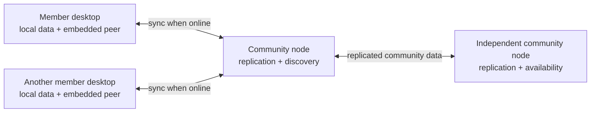
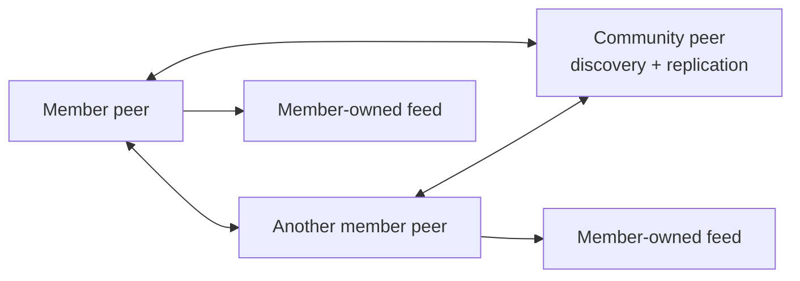

# Peer Hours

Peer Hours is a decentralized, local-first, non-profit open-source timebank for communities that want to exchange help in hours rather than conventional money. It is designed to spread organically: people can run their own peers, form communities, and share a common protocol without asking a governing authority for permission.

Members can offer what they know, request what they need, and settle a completed exchange as equal and opposite time-credit entries. Participation is open rather than membership-approved: people own their signing identities and decide locally whom to contact, trust, mute, or block. The project is inspired by the community-centered timebank model used by [BACE](https://timebank.sfbace.org/), while pursuing software that is more resilient, portable, and adaptable to present-day communities.

It is not a centralized banking service, and it has no global governing authority. A member uses a desktop application with its own local peer runtime; independently operated **community peers** keep community data available, help peers discover one another, and replicate signed activity. Members do not need to operate a server to participate. Community peers support the network; they do not supervise its members, own their identities or balances, or decide whose records are true.



## What makes Peer Hours different

- **Decentralized by design.** Each participant validates signed protocol records locally. No global administrator, company, or community-peer operator controls participation, identity, balances, or the shared truth.
- **Able to grow organically.** A person, cooperative, or community can operate compatible peer infrastructure and join or form a community without relying on one required host or vendor.
- **Open source and not for profit.** Peer Hours is not designed to collect transaction fees, sell access, or extract money from timebank exchange. People may voluntarily operate infrastructure, but the protocol does not make a central service necessary.
- **Community-supporting, not community-governing.** Always-on community peers improve discovery, replication, and availability while leaving trust, safety filters, and exchange decisions with people using the network.
- **Resilient without required community peers.** Community peers make the experience more reliable, but compatible member desktops should still be able to discover one another, connect, and replicate when community peers are unavailable.



## What Peer Hours is building

- A member-facing desktop app for participating in a local or online timebank.
- Community-operated, always-available nodes for replication, discovery, and network continuity.
- Offline-friendly offers and requests that can be prepared locally and synchronized later.
- Explicit, dual-attested time-credit transfers for settlement when participants are online.
- Reusable, community-scoped protocols and domain libraries that do not assume one central operator.

Community identifiers are hierarchical, beginning at `peer-hours/earth`, so communities can be geographic or online and can grow beyond Earth without renaming the terrestrial network:

```text
peer-hours/earth/US/CA/east-bay
peer-hours/earth/US/CA/east-bay/oakland
peer-hours/earth/online/caregivers
```

## Current state

This is an early, working foundation—not yet a production timebank. The desktop app, always-on community peer, embedded peer runtime, and development-peer simulator currently focus on making network connectivity visible and testable. Member runtimes own member feeds; a community peer has no human member identity and assists discovery and replication without owning community records or deciding member truth. The shared packages now test a narrow end-to-end protocol exchange between two direct member runtimes: signed feed declarations, published listings, an accepted proposal, a dual-attested settlement, and identical derived balances. A signed, expiring member-feed announcement can automatically open and replicate a discovered feed after peers share a discovery-core scope. Privacy-preserving agreement terms and a complete desktop member workflow are still ahead.

For the agreed product direction and an honest code-alignment audit, see [open participation and agreement privacy](docs/open-participation-and-agreement-privacy.md). For the living technical direction, see [network architecture](docs/network-architecture.md). For the production path and explicit readiness gaps, see the [production roadmap](docs/production-roadmap.md). For the active member-feed replication topology, see [record replication](docs/record-replication.md). For the package map and dependency direction, see [package architecture](docs/package-architecture.md). For the domain and settlement boundaries, see [the timebank domain model](docs/timebank-domain-model.md), [ledger settlement](docs/ledger-settlement.md), and [identity attestations](docs/identity-attestations.md). For a clear distinction between process uptime, reachability, replication, and usable timebank service, see [runtime observability](docs/runtime-observability.md).

## Learn the architecture

New to peer-to-peer or local-first systems? [Learn Peer Hours](docs/education/README.md) is a junior-friendly, diagram-led course that explains the project in short lessons. It starts with timebank communities and member roles, then builds through local data, Hypercore, append-only replication, deterministic record resolution, derived balances, and signatures. The course deliberately separates what is implemented today from the future design work still ahead.

Start with [Lesson 1: What Is a Timebank?](docs/education/01-what-is-a-timebank.md).

## Repository

Peer Hours is maintained as an npm workspaces monorepo for applications and only those shared packages that have a concrete reuse case.

## Repository structure

```text
peer-hours/
├── apps/
│   ├── bootstrap/           # Minimal read-only discovery-metadata service
│   ├── desktop/             # Electron + React desktop application
│   ├── node/                # Headless always-on community peer
│   └── dev-peers/           # Real local peers for UI/network development
├── packages/
│   ├── peer-runtime/        # Platform-neutral local peer runtime
│   ├── timebank-domain/     # Member, listing, and exchange-agreement rules
│   ├── timebank-identity/   # Community member signing-key verification
│   ├── timebank-ledger/     # Attested time-credit settlement and balance derivation
│   ├── timebank-records/    # Replicated-record envelope and deterministic resolver
│   └── timebank-settlement/ # Accepted-proposal to ledger-transfer validation
├── package.json             # Root workspace and shared scripts
├── package-lock.json        # Locked dependency versions
├── tsconfig.json            # Root TypeScript project references
├── tsconfig.base.json       # Shared TypeScript compiler defaults
├── .npmrc                   # npm workspace settings
└── .gitignore
```

### `apps/`

Applications are deployable products. Each application has its own `package.json`, source tree, build configuration, and scripts. Applications should generally remain private and should not be published to npm.

The initial application is `@peer-hours/desktop`, an Electron application whose UI is built with React and Vite. Its application shell provides a drawer-based navigation structure; network diagnostics live in the separate Network workspace rather than on the landing page.

The `@peer-hours/node` application is a headless **community peer**: an always-on peer with no human member attached. It keeps persistent Hypercore storage, joins discovery topics, relays valid member-feed announcements, and exposes only health, status, and development-only simulator diagnostics. It has no `/bootstrap` endpoint and does not decide member truth.

The `@peer-hours/bootstrap` application is a separate, minimal, read-only onboarding service. It serves configured discovery metadata at `/bootstrap`, but it runs no peer runtime, retains no member data, and has no role in identity, record, balance, or participation decisions. See [its README](apps/bootstrap/README.md).

Community identifiers use an `earth` root so the namespace can grow beyond Earth without renaming the terrestrial network later. For the full hierarchy and discovery model, see [the network architecture](docs/network-architecture.md#community-naming).

### `packages/`

Packages are for reusable code shared by two or more applications, such as UI components, domain logic, API clients, or configuration. A package intended for npm publication should use the organization scope, for example `@peer-hours/ui`.

Do not create a shared package speculatively. Add one when there is a concrete reuse case.

`@peer-hours/timebank-domain` is the pure, test-first model for member-owned listings and exchange consent. `@peer-hours/timebank-records` supplies the immutable replicated-record envelope and resolves record history into the existing timebank rules. `@peer-hours/timebank-settlement` validates that a non-reversal transfer exactly matches one accepted proposal. `@peer-hours/timebank-ledger` provides dual-attested, integer-minute transfers and derived balances. `@peer-hours/timebank-identity` provides the current in-memory Ed25519 verifier for community member keys. See [the domain model](docs/timebank-domain-model.md), [proposal settlement integration](docs/proposal-settlement-integration.md), [ledger settlement](docs/ledger-settlement.md), and [identity attestations](docs/identity-attestations.md).

## Prerequisites

- Node.js 22.12 or newer is recommended for the Electron toolchain.
- npm 10 or newer.
- macOS is required to build and test macOS application artifacts locally.

Check your versions:

```sh
node --version
npm --version
```

## Getting started

From the repository root:

```sh
npm install
```

The root install configures dependencies for all npm workspaces. The resulting `node_modules/` directory and build output are ignored by Git.

## Development

The desktop application owns an embedded local peer runtime from `@peer-hours/peer-runtime`. It does not require a separately launched node for its local status view. Run an additional node when testing replication with another peer.

To run a local community peer, use terminal 1:

```sh
npm --workspace @peer-hours/node run build
npm --workspace @peer-hours/node run start
```

Confirm that it is available:

```sh
curl http://127.0.0.1:10000/health
curl http://127.0.0.1:10000/status
```

Copy the `peerId` returned by `/status`; it is the discovery-core public key for this local community peer. In terminal 2, run the separate bootstrap service with that key:

```sh
npm --workspace @peer-hours/bootstrap run build
DISCOVERY_CORE_KEY="<peerId from /status>" COMMUNITY_NODE_URL="http://127.0.0.1:10000" npm --workspace @peer-hours/bootstrap run start
```

Confirm that the read-only bootstrap service is available:

```sh
curl http://127.0.0.1:10001/health
curl http://127.0.0.1:10001/bootstrap
```

In terminal 3, start the Vite development server and Electron together:

```sh
npm --workspace @peer-hours/desktop run dev
```

The desktop defaults to `http://127.0.0.1:10001/bootstrap`, fetches the read-only bootstrap manifest and public discovery-core key, and joins its discovery topic. The manifest can optionally name a separate community-peer diagnostics URL. The desktop app owns an embedded peer runtime and reports its own identity, community metadata, peer roster, and replication status. It also owns a persistent member feed; the Network workspace shows that feed's public key and local record count. The bootstrap service does not publish a community record core, and the community peer has no special data-writing authority.

Peer lifecycle status is reported as `discovered`, `connecting`, `connected`, `stale`, or `offline`. A peer becomes stale after 10 seconds without a fresh heartbeat and is retained for up to 30 seconds so the desktop can show the transition before removing it.

The node API also reports Hyperswarm discovery counters in `status.discovery`: `connecting` counts in-progress handshakes and `connected` counts active encrypted connections. Hyperswarm does not provide a stable peer identity until the connection event, so identity-level `discovered` records will be added when a higher-level discovery registry exists.

### Development-only simulated peer roster

To exercise the desktop network tree with an intentionally simulated roster, start or restart the **local** community node with the opt-in flag:

```sh
ENABLE_DEV_PEER_REGISTRATION=true npm --workspace @peer-hours/node run start
```

Then use a fourth terminal for the simulator:

```sh
npm --workspace @peer-hours/dev-peers run build
ENABLE_DEV_PEER_REGISTRATION=true PEER_COUNT=5 npm --workspace @peer-hours/dev-peers run start
```

Each simulator process has its own identity and storage directory and bootstraps through the separate bootstrap endpoint. For the **roster** shown by the local community peer, it also repeatedly sends this explicit development registration action to the community peer.

```json
{ "id": "simulator-peer-id", "action": "register" }
```

That action reaches `POST /dev/peers`; sending `{ "action": "unregister" }` removes the entry. The entry is deliberately labelled `source: "simulated"`. It is a UI/topology fixture, not evidence of a live Hyperswarm connection, successful record replication, or a reachable member.

**Production safety boundary:** `ENABLE_DEV_PEER_REGISTRATION` is disabled unless its value is exactly `true`; without it, `POST /dev/peers` returns `404`. The simulator also refuses to start registration unless its own environment has the same explicit flag. When enabled, the route remains intentionally unauthenticated because it is local development tooling. Never set this flag for a deployed or publicly reachable community node, and never treat `/dev/peers` as a production API.

To use a remote bootstrap node, set `PEER_HOURS_BOOTSTRAP_URL` before starting the desktop. To bypass HTTP bootstrap for a local test, set `PEER_HOURS_BOOTSTRAP_KEY` directly.

If Electron reports that it did not install correctly, repair its downloaded runtime from the repository root:

```sh
npm --workspaces=false rebuild electron --foreground-scripts
```

### Desktop checks and packaging

Run the desktop application’s checks and production build:

```sh
npm --workspace @peer-hours/desktop run typecheck
npm --workspace @peer-hours/desktop run build
```

Create macOS distributables:

```sh
npm --workspace @peer-hours/desktop run package:mac
```

The packaged `.dmg` and `.zip` files are written to the desktop workspace’s `dist/` directory. These artifacts are ignored by Git.

## Replication node

The default local community is `peer-hours/earth/US/CA/east-bay/oakland` (**Oakland Timebank**). Override it with `COMMUNITY_ID` when running a different geographic or online community. Examples include its broader parent scope, `peer-hours/earth/US/CA/east-bay`, and `peer-hours/earth/online/software`.

Build and start the node locally:

```sh
npm --workspace @peer-hours/node run build
npm --workspace @peer-hours/node run start
```

By default, node data is stored in `apps/node/data/`. Set `DATA_DIR` to use another location, such as a mounted Render disk:

```sh
DATA_DIR=/var/data npm --workspace @peer-hours/node run start
```

The health check is available at `http://127.0.0.1:10000/health`; `/status` provides the richer current runtime snapshot, including `startedAt` and `uptimeMs` for that runtime instance. Uptime does not prove external reachability, peer connectivity, replication freshness, or settlement readiness. [Runtime observability](docs/runtime-observability.md) explains the distinction and the planned operational signals. For Render, use `npm --workspace @peer-hours/node run build` as the build command and `npm --workspace @peer-hours/node run start` as the start command. Render supplies the `PORT` environment variable.

`POST /dev/peers` is disabled by default. It is available only when the node starts with `ENABLE_DEV_PEER_REGISTRATION=true`, and the local simulator requires the same flag before it attempts registration. The route accepts an ID plus the explicit `register` or `unregister` action and changes only the status roster. It remains unauthenticated development tooling and must not be enabled for a deployed or publicly reachable community node.

## Root commands

The root scripts run the corresponding script in every workspace that defines it:

```sh
npm run typecheck
npm run build
npm run clean
npm test
```

Run a command for a specific workspace with either its package name or path:

```sh
npm --workspace @peer-hours/desktop run build
npm --workspace apps/desktop run dev
```

The node workspace currently uses Node’s built-in test runner through `tsx`:

```sh
npm --workspace @peer-hours/node test
```

Tests live in the workspace’s `test/` directory. The node suite covers health, replication, and community-node HTTP behavior. The timebank-domain and timebank-ledger suites are pure TDD boundaries for membership, listings, consent, settlement, reversals, and derived balances.

Network lifecycle tests use an injected clock, so they can deterministically verify heartbeat, stale, recovery, and offline behavior without waiting in real time. The node test command builds `@peer-hours/peer-runtime` first, ensuring integration tests exercise the current shared runtime implementation.

## Adding a new application

Create a directory under `apps/` with its own `package.json`:

```text
apps/
├── desktop/
└── another-app/
    ├── package.json
    └── src/
```

Give it a unique package name, usually under the private `@peer-hours/` scope, and define at least `dev`, `build`, and `typecheck` scripts where applicable. After adding it, run:

```sh
npm install
npm run typecheck
```

## Adding a shared package

Create a directory under `packages/` with its own `package.json`, source tree, and TypeScript configuration. Applications can depend on it using its workspace package name:

```json
{
  "dependencies": {
    "@peer-hours/example": "0.1.0"
  }
}
```

Keep unpublished internal packages private. For a package that should be published to npm, use the `@peer-hours/` scope and add:

```json
{
  "publishConfig": {
    "access": "public"
  }
}
```

## Git and npm conventions

- Commit source, configuration, and `package-lock.json`.
- Do not commit `node_modules`, build output, logs, TypeScript build metadata, or `.env` files.
- Keep secrets in local environment files; only commit `.env.example` templates.
- Use focused commits that describe one repository change.
- Review package `private` and `publishConfig` settings before publishing anything to npm.

## Current npm organization

The npm scope is `@peer-hours`. The organization is owned by the npm account `mtstewart`. Applications remain private; future reusable packages may be published individually under the organization scope.
