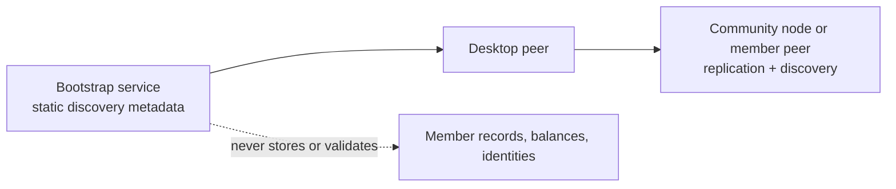

# @peer-hours/bootstrap

`@peer-hours/bootstrap` is a minimal, optional onboarding service for Peer Hours. It serves a configured discovery manifest at `GET /bootstrap` so a new desktop can learn the public discovery-core key for one community.

It is a private monorepo application, not a published npm package and not a required part of the timebank protocol.



## What it does

- Serves `GET /bootstrap` with a configured community ID, display name, discovery-core key, optional fallback bootstrap URLs, and optional pinned receipt-node metadata.
- Serves `GET /health` for deployment checks.
- Uses no database, Corestore, Hyperswarm instance, member feed, account system, or record API.

## What it must not do

- Approve, reject, identify, or register members.
- Store or relay timebank records, balances, messages, or member feeds.
- Operate as a community node or as a canonical source of truth.
- Gate participation, collect fees, require accounts, or track people.

The bootstrap service is a convenience discovery entry point: it tells a newly installed client which discovery scope to try. It does not decide whether any Peer Hours record is valid. A client that already has a discovery-core key—through an invitation, configuration, or cached manifest—can operate while this service is unavailable. For the pilot, a member-visible invitation/configuration pins the discovery scope and expected community-node receipt identities; clients compare later manifest metadata to that trust anchor. A manifest may advertise receipt identities, but an unsigned bootstrap URL is never an authority.

## Configuration

| Variable | Required | Purpose |
| --- | --- | --- |
| `DISCOVERY_CORE_KEY` | Yes | 64-character hexadecimal public key of the community node's discovery core. |
| `COMMUNITY_ID` | No | Defaults to `peer-hours/earth/US/CA/east-bay/oakland`. |
| `COMMUNITY_NAME` | No | Defaults to `Oakland Timebank`. |
| `BOOTSTRAP_NODES` | No | Comma-separated HTTP(S) fallback manifest URLs. |
| `COMMUNITY_NODE_URL` | No | HTTP(S) diagnostics URL for a separately deployed community node. |
| `COMMUNITY_RECEIPT_NODES` | No | JSON array of pinned receipt nodes: `[{"nodeId":"sha256-hex","publicKey":"base64url-spki-der","receiptUrl":"https://node.example/receipts/"}]`. It must match the nodes distributed through the community's member-visible trust channel. |
| `PORT` | No | Defaults to `10001`. |

Obtain `DISCOVERY_CORE_KEY` from the community-node operator's published configuration or from that node's `/status` response during local development. For a pilot invitation, distribute it with the expected receipt-node identities through a member-verifiable channel rather than asking members to treat a bootstrap response as the trust anchor. `nodeId` is the SHA-256 hex digest of the node's Ed25519 SPKI-DER public key; `publicKey` is that key encoded as base64url. The bootstrap service does not generate, persist, or inspect these identities.

The process validates `PORT` before listening and rejects blank entries in `BOOTSTRAP_NODES` rather than silently changing the configured fallback set. It permits at most 16 fallback URLs and rejects URLs with embedded credentials, fragments, unsupported schemes, or more than 2,048 characters so the service cannot publish metadata that the runtime will refuse. It accepts `SIGINT` and `SIGTERM` by stopping HTTP intake; repeated signals share the same close operation. Deploy it behind HTTPS when it is internet-facing. Its CORS response remains intentionally public because the manifest is public discovery metadata, not a credential or authorization decision.

## Development

```sh
npm --workspace @peer-hours/bootstrap run build
DISCOVERY_CORE_KEY="<community-peer-core-key>" npm --workspace @peer-hours/bootstrap run start
```

Run checks with:

```sh
npm --workspace @peer-hours/bootstrap test
npm --workspace @peer-hours/bootstrap run typecheck
npm --workspace @peer-hours/bootstrap run build
```
