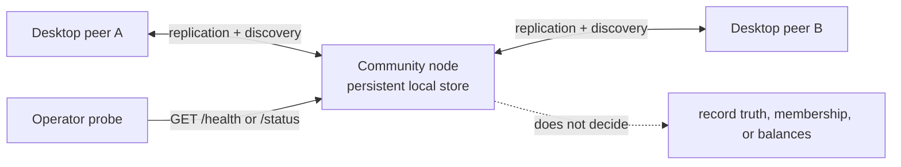

# @peer-hours/node

`@peer-hours/node` is the headless, always-available **community node** for Peer Hours. It keeps local replicated data available, joins discovery, and exposes operational diagnostics. It is not a central server, membership authority, balance service, or member-facing application.



## Deployment configuration

| Variable | Required | Behavior |
| --- | --- | --- |
| `PORT` | No | HTTP port; defaults to `10000`; must be an integer from 1 to 65535. |
| `DATA_DIR` | No | Durable storage directory; defaults to `data` beneath the process working directory. Blank and whitespace-padded values are rejected. |
| `PEER_HOURS_BOOTSTRAP_KEY` | No | 64-character hexadecimal discovery-core key. |
| `ENABLE_DEV_PEER_REGISTRATION` | No | Development simulator route only; defaults to `false` and accepts only `true` or `false`. Never enable it on a public deployment. |

Mount `DATA_DIR` on persistent storage owned by the service account. The directory contains recoverable but important local replication state; replacing it creates a new local cache and may require re-discovery and replication. Do not treat it as a backup, and do not delete it as a routine deployment step.

## Health and diagnostics

- `GET /health` is a lightweight, non-mutating readiness signal. It returns `200` only after the runtime is online; startup or error states return `503`. The payload includes the discovery-core key and current core length.
- `GET /status` returns a point-in-time runtime snapshot: uptime, listening state, discovery connection counts, known peers, replication-core state, member-feed state, bootstrap state, and the current runtime error if any.

Both endpoints are diagnostic observations, not proof of complete replication, record authorization, counterparty agreement, or social finality. `GET /status` can show an online node with no peers or an old local record history; pair it with external HTTP probing, storage monitoring, and a community-defined freshness policy.

The process listens on `0.0.0.0` and handles `SIGINT` and `SIGTERM` by stopping HTTP intake before it closes its swarm and local storage. A repeated shutdown signal reuses the original close operation. Configure the platform grace period to allow this closure to finish; the application does not force a process exit.

## HTTP safety boundaries

The public HTTP surface is intentionally narrow: `/health` and `/status`. The development-only `POST /dev/peers` simulator is absent unless explicitly enabled. There is no bootstrap manifest, record, member, balance, or administrative write endpoint.

Request handling uses bounded request/header/keep-alive timeouts, a header count limit, a requests-per-connection limit, fixed security headers, and non-cacheable diagnostic responses. Unexpected request bodies are discarded. Parser-level malformed HTTP receives a fixed `400` close response without echoing parser details or request bytes.

Run focused checks with:

```sh
npm --workspace @peer-hours/node test
npm --workspace @peer-hours/node run typecheck
npm --workspace @peer-hours/node run build
```

## Current limitations

- A healthy process does not prove public reachability, durable backup, or replication freshness.
- Bootstrap metadata and diagnostics are untrusted operational inputs; their structural validation does not make a bootstrap endpoint authoritative.
- The node retains and replicates data but does not settle balances, authorize members, or make finality decisions.
- Production rollout still needs external probes, backup/restore exercises, storage-capacity alerts, and an explicit community freshness policy.
