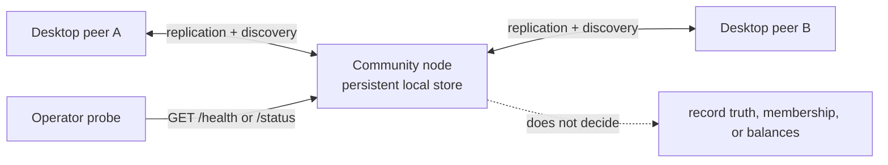

# @peer-hours/node

`@peer-hours/node` is the headless, always-available **community node** for Peer Hours. It keeps local replicated data available, joins discovery, and exposes operational diagnostics. It is not a central server, membership authority, balance service, or member-facing application.



## Deployment configuration

| Variable | Required | Behavior |
| --- | --- | --- |
| `PORT` | No | HTTP port; defaults to `10000`; must be an integer from 1 to 65535. |
| `DATA_DIR` | No | Durable storage directory; defaults to `data` beneath the process working directory. Blank and whitespace-padded values are rejected. |
| `PEER_HOURS_BOOTSTRAP_KEY` | No | 64-character hexadecimal discovery-core key. |
| `ENABLE_DEV_PEER_REGISTRATION` | No | Development simulator route only; defaults to `false` and accepts only `true` or `false`. Never enable it on a public deployment. |
| `RECEIPT_IDENTITY_PATH` | No | Absolute or relative path for the node's persistent Ed25519 receipt identity; defaults to `DATA_DIR/receipt-identity.pem`. The file is private infrastructure key material and must be retained in encrypted backups with restrictive filesystem permissions. |

Mount `DATA_DIR` on persistent storage owned by the service account. The directory contains recoverable but important local replication state; replacing it creates a new local cache and may require re-discovery and replication. Do not treat it as a backup, and do not delete it as a routine deployment step.

## Health and diagnostics

- `GET /health` is a lightweight, non-mutating readiness signal. It returns `200` only after the runtime is online; startup or error states return `503`. The payload includes the discovery-core key and current core length.
- `GET /status` returns a point-in-time runtime snapshot: uptime, listening state, discovery connection counts, known peers, replication-core state, member-feed state, bootstrap state, and the current runtime error if any.

Both endpoints are diagnostic observations, not proof of complete replication, record authorization, counterparty agreement, or social finality. `GET /status` can show an online node with no peers or an old local record history; pair it with external HTTP probing, storage monitoring, and a community-defined freshness policy.

`GET /receipts/:transferId` is a read-only availability endpoint. When the node has locally resolved, locally ledger-admitted, and retained the named transfer, it returns a fresh signed `peer-hours/replication-receipt/v1` receipt. The receipt binds the community, transfer ID, digest of the complete canonical transfer (including its attestations), retention time, node ID, public key, and signature. It attests retention only: it neither validates a transfer for another runtime nor grants the node power to alter, reject, or reverse it. A desktop must accept it only when its node ID and public key match the pinned `receiptNodes` metadata for the community. A missing or unavailable receipt route is not a negative settlement decision.

The process listens on `0.0.0.0` and handles `SIGINT` and `SIGTERM` by stopping HTTP intake before it closes its swarm and local storage. A repeated shutdown signal reuses the original close operation. Configure the platform grace period to allow this closure to finish; the application does not force a process exit.

## HTTP safety boundaries

The public HTTP surface is intentionally narrow: `/health` and `/status`. The development-only `POST /dev/peers` simulator is absent unless explicitly enabled. There is no bootstrap manifest, record, member, balance, or administrative write endpoint.

Request handling uses bounded request/header/keep-alive timeouts, a header count limit, a requests-per-connection limit, fixed security headers, and non-cacheable diagnostic responses. Unexpected request bodies are discarded. Parser-level malformed HTTP receives a fixed `400` close response without echoing parser details or request bytes.

Run focused checks with:

```sh
npm --workspace @peer-hours/node test
npm --workspace @peer-hours/node run typecheck
npm --workspace @peer-hours/node run build
```

## Pilot operating baseline

For the first limited pilot, run two independently operated community nodes per discovery scope. They must have separate durable storage, operator credentials, backup access, and declared failure domains; two processes on the same account, host, or backup system do not constitute resilience. Preserve each node's `receipt-identity.pem` (or configured `RECEIPT_IDENTITY_PATH`) through restart and restore; replacing it creates a new identity that a pinned client will reject until the community completes a visible trust-change process. The pilot's member-facing meaning is defined in [the pilot operating policy](../../docs/pilot-operating-policy.md): one verified node receipt is **durably replicated**, while receipts from two independent nodes are **resiliently replicated**. A receipt is evidence that a configured node retained the required history. It is never an authority to accept, reject, modify, or reverse a member record.

Treat the node's full durable `DATA_DIR` as recoverable state. The pilot baseline is encrypted, complete daily snapshots, at least 30 retained daily restore points, two named community custodians for recovery material, and a restore drill before enrollment and at least quarterly. Do not copy individual files into a live Corestore or delete the directory during a deployment. The detailed recovery and incident expectations live in the policy document; this README describes the current runtime, not a claim that the checks are automated.

## Verified backup and restore tooling

After building the node package, operators can create and verify a **complete, stopped-node** snapshot. The command recursively copies the entire `DATA_DIR`, including the Corestore state and the node's receipt identity, writes a SHA-256 manifest, then verifies every copied file before publishing the backup directory. It refuses a live-copy request unless the operator explicitly confirms the node is stopped, refuses existing or nested destinations, and never overwrites a data directory.

```sh
npm --workspace @peer-hours/node run build

# Stop this community node cleanly first. The destination must not already exist.
npm --workspace @peer-hours/node run backup:create -- \
  --source /var/lib/peer-hours \
  --destination /srv/peer-hours-backups/node-a/2026-07-18 \
  --node-stopped

# Verify the manifest before retaining, transferring, or restoring this snapshot.
npm --workspace @peer-hours/node run backup:verify -- \
  --backup /srv/peer-hours-backups/node-a/2026-07-18
```

The tool writes a plaintext filesystem snapshot; it does **not** provide encryption, remote copying, retention, or custody management. Put the destination on encrypted storage and make its access controls and off-host replication part of the community's backup process. Do not upload the receipt private key to an unencrypted or single-custodian location.

To rehearse recovery, first verify that the target location is unused, then restore only into a fresh directory. This preserves the failed data directory for investigation and makes rollback possible without destructive copy operations.

```sh
# The fresh destination must not already exist. This does not modify either source path.
npm --workspace @peer-hours/node run backup:restore-preflight -- \
  --backup /srv/peer-hours-backups/node-a/2026-07-18 \
  --destination /var/lib/peer-hours-restored

# Stop the target node (if one exists elsewhere), restore, then configure DATA_DIR to this new path.
npm --workspace @peer-hours/node run backup:restore -- \
  --backup /srv/peer-hours-backups/node-a/2026-07-18 \
  --destination /var/lib/peer-hours-restored \
  --node-stopped
```

After startup, wait for `GET /health` to return `200`, inspect `GET /status`, and compare known history with an independent community node or desktop peer after catch-up. The manifest proves only that the selected stopped-node files copied without later alteration; it cannot prove that the node had received all community history, that the storage platform is durable, or that a restore has caught up.

## Current limitations

- A healthy process does not prove public reachability, durable backup, or replication freshness.
- Bootstrap metadata and diagnostics are untrusted operational inputs; their structural validation does not make a bootstrap endpoint authoritative. The manifest can carry static `receiptNodes` identity metadata, but a deployment still needs a member-visible pinning and rotation process; no bootstrap URL becomes an authority merely by serving it.
- The node retains and replicates data but does not settle balances, authorize members, or make finality decisions.
- Production rollout still needs external probes, backup/restore exercises, storage-capacity alerts, and an explicit community freshness policy.

## Redundancy and recovery runbook

Run at least two independently deployed community nodes for the same discovery scope when availability matters. Give each one its own durable `DATA_DIR`, operator credentials, and failure domain. They should replicate the same member-owned feeds through ordinary peer discovery; neither node receives a special authority over the other or over a member's records.

Bootstrap availability is separate from community-node availability. Configure more than one bootstrap endpoint in the manifest's `bootstrapNodes` list. A runtime can retry a supplied endpoint list, remembers validated manifest-advertised alternatives, and exposes the active endpoint, failure count, last error, and last successful refresh in its runtime status. This prevents one endpoint outage from being silently indistinguishable from a discovery failure. It does not authenticate an endpoint or prove that a fallback is operated by a trusted party; the pilot direction is to compare bootstrap information with member-installed discovery and node-identity pins.

For a planned restore, stop the affected node cleanly, verify a previously tested *consistent* backup, and restore it into a new `DATA_DIR`, then start it and wait for `GET /health` to return `200`. Inspect `GET /status` for its local core key, discovery activity, known member feeds, and bootstrap diagnostics. Finally, compare a known member-feed record history from an independent desktop or community node after replication has had time to catch up. Do not copy individual files into a live Corestore, overwrite a previous directory, or treat a fresh empty directory as a restore: it is only a new cache that must rediscover and replicate data.

The current API cannot prove catch-up completeness or durable replication across a failure domain. Operators must define a freshness window, backup cadence/retention, restore objective, and an independent evidence source before representing the service as resilient to members.
