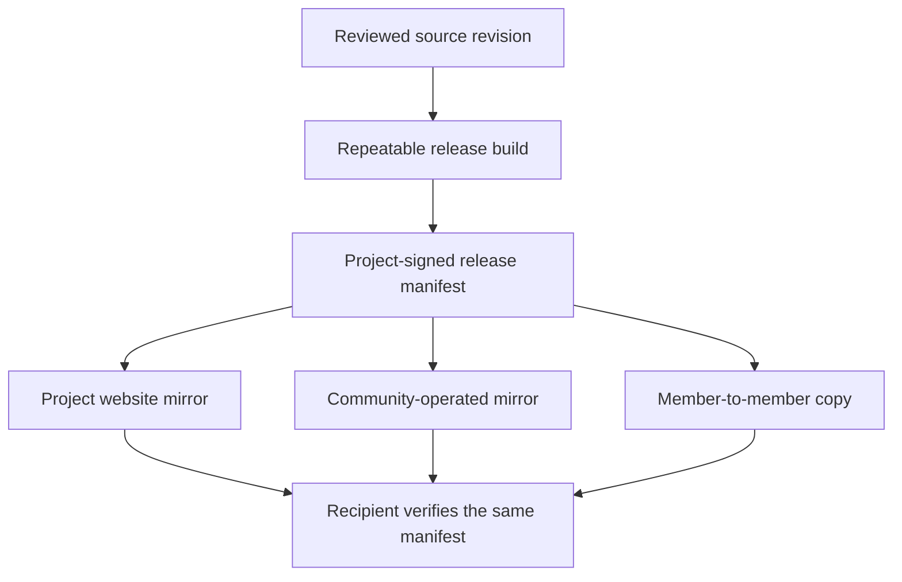

# Decentralized distribution and release trust

Peer Hours must remain usable and distributable without a central app store, commercial certificate provider, vendor-operated download host, or project-controlled account system. Distribution is a delivery concern; it must never become authority over member identities, community membership, records, balances, or protocol truth.

## Direction

Linux is the initial reference distribution path. It permits ordinary project- and community-controlled artifact verification without paid platform membership. A public release should be possible through a project website, community-operated mirror, personal mirror, or removable media, provided the recipient can verify the same release evidence.

The project may publish through GitHub Releases, an app store, a commercial signing service, or a platform package repository as optional convenience mirrors. None of these is the canonical source of member authority or a prerequisite for a community to use Peer Hours.

## Release evidence

Before calling an artifact a public release, publish enough information for a recipient to decide whether it is the intended build:

- source revision and version;
- SHA-256 checksum for each artifact;
- a detached signature over a release manifest made with a project-controlled release key;
- a software bill of materials or equivalent dependency record; and
- instructions for obtaining the project release-key fingerprint through more than one independent channel.

When practical, publish reproducible-build instructions and provenance evidence. Do not claim reproducibility until a repeatable build process has actually been demonstrated and checked in CI.

The release signing key should be held and rotated through a documented project process. The exact algorithm, custody arrangement, recovery process, and rotation format are deliberately undecided until the project can implement and test them. No single maintainer's personal machine should silently become permanent release authority.

## Platform convenience layers

Apple, Microsoft, Linux distribution repositories, and third-party signing services affect how a recipient's operating system presents an installer. They do not affect Peer Hours protocol validity or authority.

- A platform-signed installer is an optional convenience artifact and must carry the same project release evidence as every other artifact.
- An unsigned macOS or Windows pilot artifact may be distributed only with clear instructions that explain the warning, the verification steps, and the limits of bypassing it. It must never train members to accept an unknown binary blindly.
- A self-signed root certificate must not be presented as a normal public-installation step, because asking a member to change their machine's root trust weakens their device security.
- Automatic update mechanisms must verify project-controlled release evidence and must not silently change member keys, local records, saved community scopes, or trust decisions.

## Mirror and outage behavior

Every mirror is a convenience source. A mirror compromise, app-store removal, or website outage must not make a correctly saved release key, release manifest, community key, member identity, or local record history disappear. Communities may retain known-good installers and manifests, but operators should publish the artifact version and checksum rather than claiming a mirror is inherently trustworthy.

The project still needs a practical mirror-discovery and incident process: how a compromised manifest is revoked, how a replacement key is authenticated, and how a recipient distinguishes an outdated mirror from a current one. Those are release-engineering requirements, not protocol authority.
