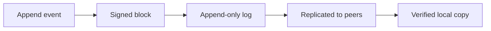
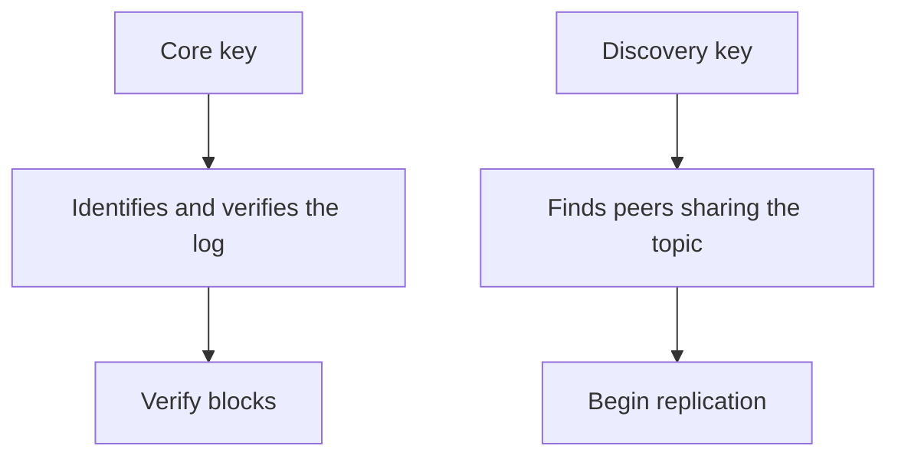
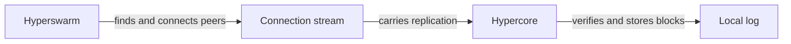
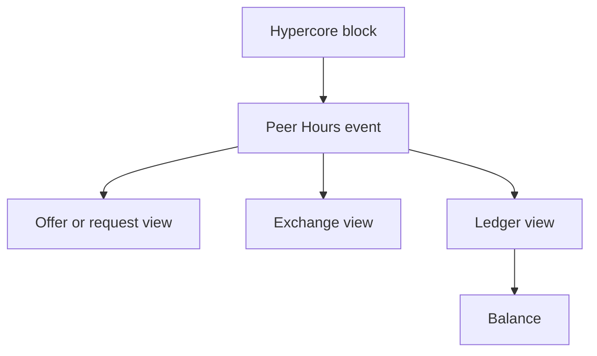

# Hypercore Basics

This lesson introduces the storage primitive underneath Peer Hours. It is intentionally focused on one idea: a Hypercore is a secure, append-only log that can be replicated by other peers.

The official Hypercore project describes it as a secure, distributed append-only log with sparse replication, real-time updates, and signed Merkle-tree verification. See the [Hypercore repository](https://github.com/holepunchto/hypercore) for the full API.

## The mental model

Start with a list that only grows:

```text
index   value
-----   ------------------------------
0       "Alice offered garden help"
1       "Bob requested translation"
2       "Alice completed an exchange"
3       "Community event created"
```

The important property is that entries are not silently edited in place. A new fact is represented by a new entry. Other peers can verify the history they receive and download only the portions they need.



Hypercore does not decide what an event means. It does not know what an offer, request, or time credit is. It stores and verifies ordered data. Peer Hours supplies the meaning later.

## Creating a local Hypercore

Install the low-level package in a small experiment:

```sh
npm install hypercore
```

Then create a log on disk and append two records:

```js
import Hypercore from "hypercore";

const core = new Hypercore("./data/example-core", {
  valueEncoding: "json",
});

await core.ready();

await core.append({
  type: "offer.created",
  memberId: "member-alice",
  description: "Garden help",
  hours: 2,
});

await core.append({
  type: "request.created",
  memberId: "member-bob",
  description: "Translation help",
});

console.log("blocks:", core.length);
console.log("first record:", await core.get(0));

await core.close();
```

The `valueEncoding: "json"` option makes each block decode as JSON when read. The log still stores encoded blocks; JSON is a convenience for this example, not a rule imposed by Hypercore.

## Keys and identity

When a new core is created, Hypercore creates key material used to authenticate its log. The public key identifies the core. The discovery key is used to find peers without revealing the public key through the discovery topic alone.



This distinction matters for Peer Hours. A member identity and a community ledger are related, but they should not automatically be treated as the same key or the same log. We need to decide which keys represent people, devices, communities, ledgers, and replication topics.

## Reading data

Blocks are addressed by index:

```js
const record = await core.get(0);

for (let index = 0; index < core.length; index += 1) {
  console.log(index, await core.get(index));
}
```

If a requested block is not local yet, Hypercore can wait for it to download from a peer. This is one reason a replicated log is useful for a local-first application: the desktop can have a partial local view and request more data when needed.

## Replication is not discovery

These are separate jobs:



- Hypercore defines the log and its replication protocol.
- Hyperswarm helps peers discover and connect to one another.
- Corestore manages multiple Hypercores under one storage directory.
- Peer Hours defines the application events and rules carried by those logs.

An HTTP endpoint can report status or support administration, but it is not a substitute for the underlying peer replication protocol.

## From Hypercore to Peer Hours

The conceptual transformation looks like this:



For example, a Peer Hours event might look like:

```json
{
  "type": "exchange.completed",
  "exchangeId": "exchange-123",
  "providerId": "member-alice",
  "recipientId": "member-bob",
  "hours": 2,
  "completedAt": "2026-07-18T12:00:00.000Z"
}
```

Hypercore can store this event, authenticate the log, and replicate it. It does not automatically prove that Alice and Bob agreed to the exchange or that the service happened. Peer Hours must add signatures, validation rules, participant consent, dispute handling, and a deterministic way to derive balances.

## What Hypercore does and does not provide

| Hypercore provides | Peer Hours still needs |
| --- | --- |
| Append-only storage | Offer and request semantics |
| Signed log verification | Member identity rules |
| Replication | Peer discovery policy |
| Sparse data access | Exchange validation |
| Local persistence | Time-credit accounting |
| Ordered log positions | Dispute and moderation rules |

The key lesson is that Hypercore is a foundation, not the currency. Peer Hours is the domain model and community practice built on top of that foundation.

## Next lesson

The next educational step should explain Corestore and Hyperswarm together by running two local peers, then showing how an event moves from one local log to another. After that, Autobase can introduce multiple writers and derived views.
