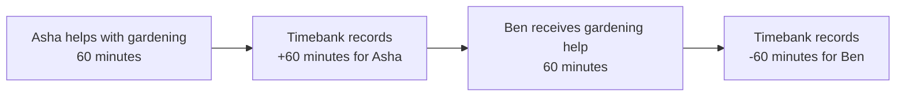

# Lesson 1: What Is a Timebank?

A timebank is a community where people exchange help using **time** as the unit of value. One hour of help earns one time credit; receiving one hour of help spends one time credit. The kind of work can differ: an hour of gardening and an hour of technology help are both one peer-hour.

## What you already know

In a conventional web application, you may be used to a marketplace that records payments in dollars. A timebank has a similar record of exchanges, but its unit is minutes or hours and its purpose is mutual support rather than profit.



The arrows do not mean Asha gives credits directly to Ben. They show one completed exchange: Asha provided time, Ben received time, and the community can account for both sides.

## A small example

Imagine this completed exchange:

```text
Provider:  Asha
Recipient: Ben
Time:      45 minutes
```

The useful result is two balance changes:

```text
Asha: +45 minutes
Ben:  -45 minutes
```

**Expected observation:** the total change is zero. The timebank has not created money; it has recorded who contributed time and who received it.

## Peer Hours connection

Peer Hours is software for communities that want to run this kind of exchange. The desktop can publish signed offers and requests, propose an exchange, accept it as the other participant, and publish a signed completion acknowledgement. The important idea is that a balance is not a number someone edits by hand. It is calculated from locally verified, ledger-admitted exchange records.

**Not yet guaranteed:** a displayed balance is a local derivation. It is not a bank guarantee, a claim that every peer has received the same records, or a replacement for a community's dispute process.

This lesson is about the social model, not the network technology. Before learning how data moves between computers, we need to know who the software is for: a community.

## Takeaway

A timebank records a completed exchange as equal-and-opposite time changes. It is mutual accounting for help, not a marketplace payment system.

## Next lesson

Continue to [Lesson 2: What Is a Peer Hours Community?](./02-what-is-a-community.md)
