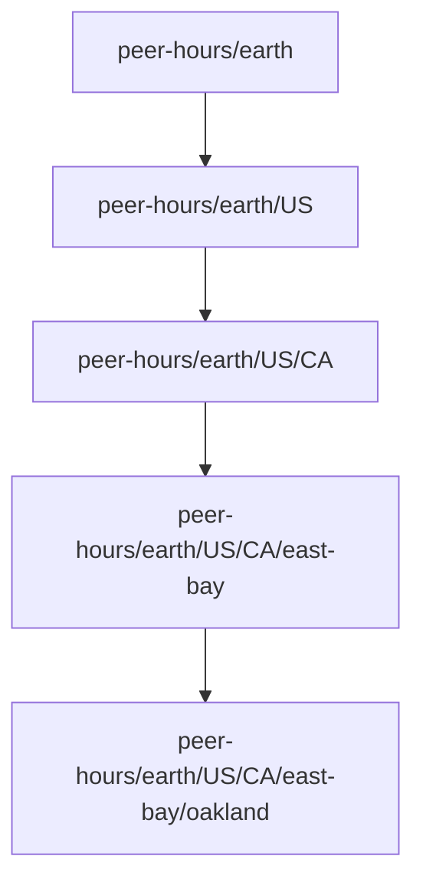

# Lesson 2: What Is a Peer Hours Community?

A Peer Hours community is the group of people who agree to exchange time together. It might be a neighborhood, a city-wide timebank, a mutual-aid group, or an online group with a shared purpose.

## What you already know

In a traditional application, this is close to an organization, tenant, or workspace. A user signs into the application and works inside one organization’s data. In Peer Hours, a community defines the boundary for its members, exchanges, and records.



The identifier is hierarchical. Each additional segment narrows the scope. Online communities can use an `online` branch instead, such as `peer-hours/earth/online/language-exchange`.

## A location name is not a network route

`earth`, `US`, and `east-bay` describe a community's social scope. They do **not** mean a computer in Oakland needs a special direct connection to every other computer in that named place. A community identifier tells the software which records and discovery rules belong together; the network can use any available connected peers to share those records.

This matters for future off-world communities. A name such as `peer-hours/mars/olympus-mons` can keep its own membership and ledger rules without requiring every Mars computer to hold one permanent, impossible “laser link” to Earth. Location gives people a meaningful boundary; connections form separately as a network.

## A small example

Two records can look similar but belong to different communities:

```json
{ "communityId": "peer-hours/earth/US/CA/east-bay", "minutes": 60 }
```

```json
{ "communityId": "peer-hours/earth/online/language-exchange", "minutes": 60 }
```

**Expected observation:** they must not be mixed together. A member’s East Bay balance is not automatically a balance in the language-exchange community.

## Peer Hours connection

Peer Hours includes `communityId` on important records. That lets the software reject an otherwise valid record if it belongs to the wrong community. It also gives communities room to choose discovery scope, local safety defaults, and exchange policies later—but not whether a person may participate at all.

A community is not necessarily a company running a central app. It is the shared social and data boundary that participating computers recognize.

## Next lesson

Continue to [Lesson 3: Desktop App vs Community Node](./03-desktop-app-and-community-node.md)
