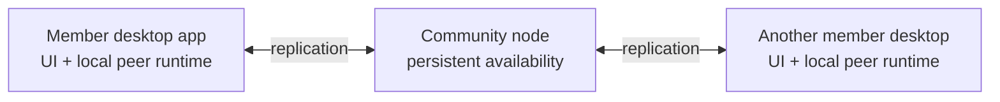

# Lesson 3: Desktop App vs Community Node

Peer Hours has two different kinds of software. The desktop app is for a member using the timebank. A community node is always-available infrastructure operated for that community.

## What you already know

In client/server development, you might picture a browser client and one API server. The closest translation is helpful, but incomplete: a Peer Hours desktop app keeps useful data locally and participates in replication. A community node helps data remain available when members close their apps.



The community node is not just a web API that owns all truth. It is a reliable participant that stores and shares replicated community data.

## A small example

Suppose Maya creates an offer while her desktop is running:

```text
Maya's desktop stores the offer locally.
Maya's desktop connects to the community node.
The community node receives a replicated copy.
Maya closes her desktop.
```

**Expected observation:** the community node can still retain the offer for other connected participants. Maya does not need to keep her laptop running all day.

## Peer Hours connection

The repository contains `apps/desktop` for the Electron member application and `apps/node` for the headless community node. Keeping their roles distinct protects the member experience from server-operations concerns while still making the network resilient.

This design can use web-style HTTP endpoints for bootstrap or diagnostics, but replication is the more important path for sharing timebank records.

## Next lesson

Continue to [Lesson 4: What Is a Peer?](./04-what-is-a-peer.md)
