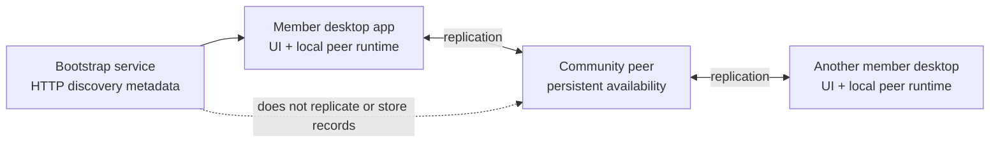

# Lesson 3: Desktop App, Community Peer, and Bootstrap Service

Peer Hours has three distinct software roles. The desktop app is for a member using the timebank. A community peer is always-available replication infrastructure. A bootstrap service is a small optional HTTP entrypoint that tells a new desktop which discovery scope to join.

## What you already know

In client/server development, you might picture a browser client and one API server. That translation is helpful, but incomplete: a Peer Hours desktop keeps useful data locally and participates in replication. A community peer helps known member feeds remain available when members close their apps. The bootstrap service is neither a peer nor a database—it only supplies public discovery metadata.



The community peer is not just a web API that owns all truth. It is a reliable participant that stores and shares replicated community data. The bootstrap service provides the initial map, then stays out of the record path.

## A small example

In the planned member workflow, suppose Maya publishes an offer while her desktop is running:

```text
Maya's desktop stores the offer locally.
Maya's desktop connects to a community peer or another compatible member peer.
That peer receives a replicated copy of Maya's announced feed.
Maya closes her desktop.
```

**Expected observation:** after the signed record is replicated, a community peer can retain Maya's feed for other connected participants. The bootstrap service never receives the offer or feed. Maya does not need to keep her laptop running all day. The desktop offer-publishing screen is not implemented yet.

## Peer Hours connection

The repository contains `apps/desktop` for the Electron member application, `apps/node` for the headless community peer, and `apps/bootstrap` for the minimal discovery-metadata service. Keeping these roles separate protects the member experience from server-operations concerns while keeping bootstrap from quietly becoming a central authority.

HTTP is used for bootstrap and diagnostics; peer-to-peer replication is the path for sharing timebank records.

## Takeaway

The desktop is a member's local application and peer. A community peer is optional always-on support infrastructure, not a central database or approval service. A bootstrap service only helps the desktop discover where to begin; it is not a peer and never handles member records.

## Next lesson

Continue to [Lesson 4: What Is a Peer?](./04-what-is-a-peer.md)
