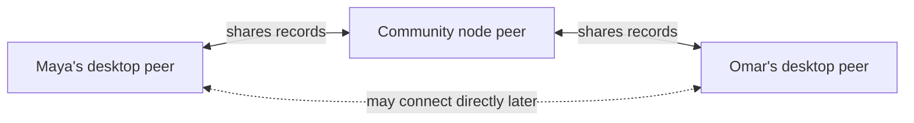
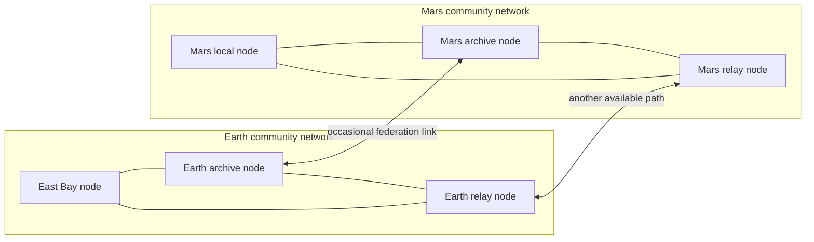

# Lesson 4: What Is a Peer?

A peer is any running Peer Hours runtime that can exchange replicated data with another runtime. A member’s embedded desktop runtime is a peer. A community node is also a peer when it is online and participating.

## What you already know

In a browser application, the browser is usually only a client and the API server is usually only a server. Peer-to-peer systems use a different mental model: a connected participant can receive data and share data. Its role depends on what it is currently allowed and able to do.



“Peer” describes network participation. It does not mean that every peer has equal permissions or must stay online forever.

## A mesh is a web, not a beam

It is tempting to imagine two distant communities as one direct, bidirectional line: Earth on one end and Mars on the other. A resilient peer network is closer to a spider's web. Nearby and always-on peers create overlapping connections. Records can be copied across several connections, so no single link needs to carry the whole community.



If one Earth-to-Mars path is unavailable, a second bridge may later carry the same replicated records. Members usually connect to a nearby or trusted community node; they do not need to know every path inside the web. A record being copied across multiple paths is still the same record, so its identity and signatures—not the route it took—tell us what it is.

**Important boundary:** this diagram is a proposed federation topology, not a claim about the current runtime. Today Peer Hours establishes direct peer sessions after discovery and can replicate a known member feed between connected runtimes. It does not yet implement general multi-hop routing, feed discovery, automatic bridge selection, or an interplanetary transport layer. Those capabilities need explicit protocol and policy design.

## A small example

The Network workspace might report:

```text
Your peer: online
Community nodes: 1
Live remote peers: 2
```

**Expected observation:** “your peer” is the runtime inside the desktop app. The two remote peers are other connected runtimes. The community node count describes available infrastructure, not a separate kind of member.

## Peer Hours connection

Peer Hours uses precise language because it prevents an important misunderstanding. A **community node** is independently deployed, always-available infrastructure. A **peer** is any participating runtime, including the desktop app’s embedded runtime. We avoid saying “peer node” when one of those clearer terms is meant.

Later lessons will introduce how peers find each other and replicate records. First, it helps to understand why member desktops are peers without also being servers.

## Next lesson

Continue to [Lesson 5: Why Members Do Not Host Servers](./05-why-members-do-not-host-servers.md)
