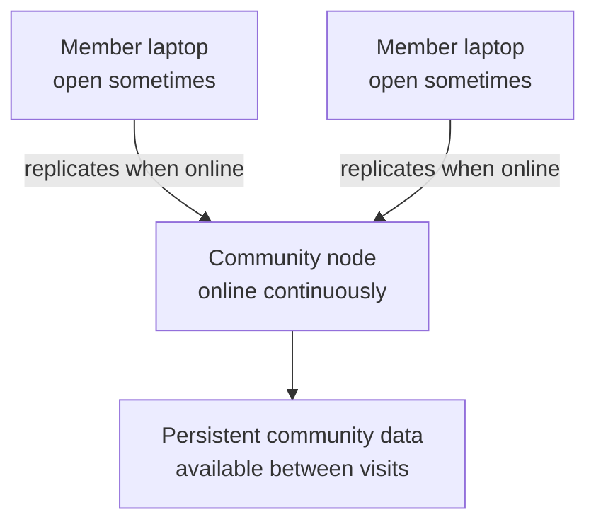

# Lesson 5: Why Members Do Not Host Servers

A member’s Peer Hours desktop app participates in the network while it is open. It is not expected to be a permanently reachable server. Community nodes provide the always-available layer instead.

## What you already know

You may have deployed an API to a cloud host so it is always reachable. Asking every member to do that would require technical skill, stable networking, security maintenance, and a machine that never sleeps. That is not a reasonable requirement for joining a timebank.



The node improves availability without changing a member into an infrastructure operator.

## A small example

Consider two evenings:

```text
6 PM: Asha's desktop connects and receives recent records.
7 PM: Asha closes the app and her laptop sleeps.
9 PM: Ben opens Peer Hours and connects to the community node.
```

**Expected observation:** Ben can still obtain records retained by the community node. He does not need a live connection to Asha’s laptop.

## Peer Hours connection

This is why Peer Hours plans for independently deployed community nodes. They support discovery, persistence, and replication for a particular timebank. They do not make ordinary members responsible for uptime.

There is still a design question ahead: how will a member announce their feed so other peers can find it privately and safely? The current project already gives each runtime its own writable member feed; the missing piece is peer-to-peer feed discovery.

## Next lesson

Continue to [Lesson 6: What Local-First Means](./06-what-local-first-means.md)
