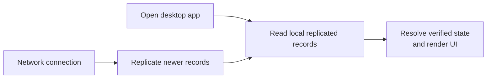

# Lesson 6: What Local-First Means

Local-first means the desktop app keeps understandable data on the member’s computer and can work from that local data before, during, and after a network connection. The network synchronizes records; it is not the only place the app can look.

## What you already know

Many web apps start by fetching data from an API:

```text
screen opens → GET /api/balance → server responds → screen renders
```

Peer Hours instead aims for this flow:



The app can show the newest local state immediately, then update when newer records arrive.

## A small example

Assume the desktop already holds these verified records:

```text
Transfer 1: Asha +30, Ben -30
Transfer 2: Asha +15, Chen -15
```

The app can calculate:

```text
Asha balance: +45 minutes
```

**Expected observation:** this calculation does not require a request to a central balance endpoint. It uses local records. A connection may later bring Transfer 3 and change the result.

## Peer Hours connection

Peer Hours’ tested record resolver turns immutable replicated records into useful state: active member keys, accepted proposals, valid transfers, and balances. This makes the data trail easier to inspect and recover than a single mutable balance field.

Local-first does not mean “ignore the network.” It means the network improves and synchronizes local knowledge rather than being the sole gatekeeper for every screen.

## Next lesson

Continue to [Lesson 7: Offline Work and Online Settlement](./07-offline-and-online-work.md)
