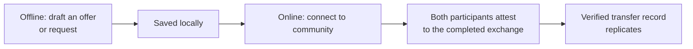
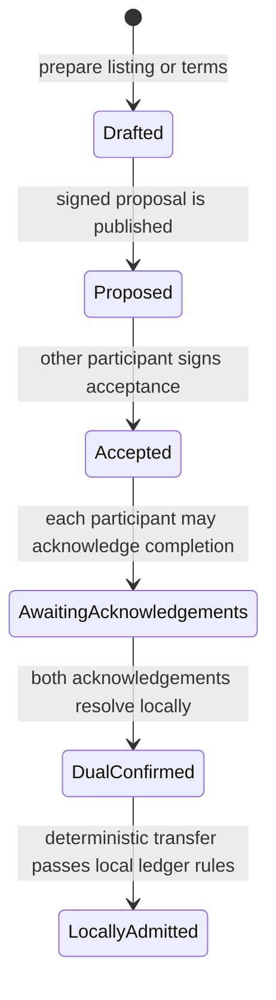

# Lesson 7: Offline Work and Online Settlement

Peer Hours separates activities that are useful offline from actions that change the shared timebank record. Members can prepare or view some information without a connection, but a completed exchange needs both participants' signed evidence and a path to share it before another runtime can independently admit it.

## What you already know

This is similar to a shopping cart versus a completed payment. You can draft a cart locally. Charging a card requires contacting the payment system. In Peer Hours, an offer or request can be drafted locally, while a time transfer needs connected participants and replicated records.



The online requirement protects the shared accounting history. It gives the system a chance to validate the transfer and make it available to the community.

## A small example

Ravi and Elena agree that Ravi helped for 60 minutes.

```text
Offline: Ravi drafts “60 minutes of tutoring completed.”
Online: Ravi and Elena connect and each approve the same transfer terms.
Result: the signed transfer can be replicated and balances update.
```

**Expected observation:** drafting alone does not change either balance. Both attestations and online replication are required before the shared ledger treats it as settled.

## What “online” does and does not mean

Being online is not a single final step. A member may be connected to one peer while the
counterparty is offline, or may publish an acknowledgement that has not reached a
community node yet.



`LocallyAdmitted` is intentionally not labelled “globally final.” It means this runtime
has the evidence and rules needed to include the transfer in its local derived ledger.

## Peer Hours connection

The current packages and desktop model this distinction: proposals describe an intended exchange; the other participant signs acceptance; each participant can sign a separate completion acknowledgement; settlement validates a deterministic transfer against the accepted proposal and both attestations; identity verifies the signatures; and the ledger derives the two balance changes. The UI presents acknowledgement and locally ledger-admitted state separately.

**Not yet guaranteed:** replication to every participant, conflict/dispute resolution, and social finality are not inferred from one local admission.

This boundary is deliberate. It lets people record needs and offers in everyday life while treating shared time-credit settlement as a verifiable, connected action.

## Takeaway

Drafting can be local. A balance-changing settlement needs both people’s confirmation and a visible network path for sharing the resulting record.

## Next lesson

Continue to [Lesson 8: Where Is the Database?](./08-where-is-the-database.md) to replace the usual single-server storage mental model.
