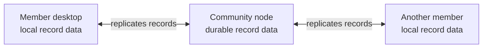
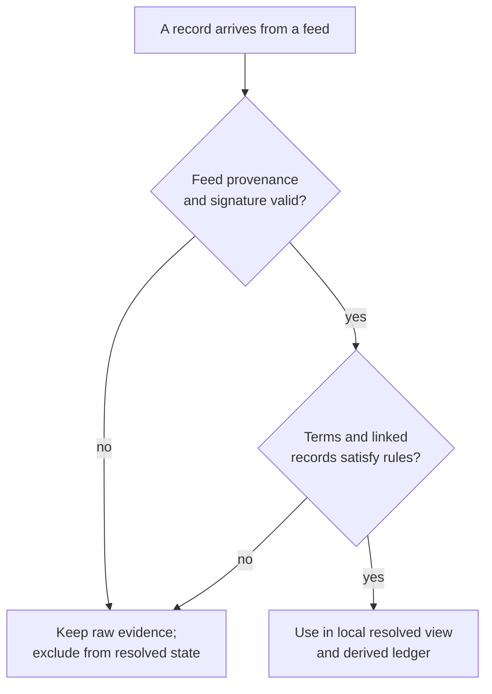

# Lesson 8: Where Is the Database?

In a traditional web application, it is easy to point to the database: it sits behind the API, usually beside the server. Peer Hours has data in more than one place. That is intentional.

## What you already know

You may be used to this path:

```text
Browser → HTTP API → server database → HTTP response → screen
```

The server database is normally the authoritative place to ask for a member's current data.

## One new idea

In Peer Hours, each participating runtime can hold local copies of the feeds it knows. The desktop reads its local data first. A community node can keep durable copies available for the community. Compatible peers can synchronize the same append-only histories.



There is not one database connection that every screen must query. There are copies of the same record history, which can converge when peers are connected.

## Small example

Imagine a completed two-hour exchange becomes a transfer record:

```json
{
  "kind": "ledger.transfer",
  "communityId": "peer-hours/earth/US/CA/east-bay",
  "minutes": 120
}
```

After replication, Alice's desktop, Bob's desktop, and the community node may each store that immutable record locally. Each can independently calculate the same balance change from it—provided it also has the declarations, proposals, acceptances, and acknowledgements that the resolver requires.

## Peer Hours connection

Today, every member runtime owns a writable member feed. An always-on community node can retain and replicate feeds it knows, but it does not own a shared record core or expose a record API. Signed, expiring feed announcements let compatible runtimes discover a declared feed on a shared discovery core; the desktop publishes listings and exchange workflow records through a narrow main-process boundary.

## Copies are not a vote



Replication makes evidence available. Local validation decides whether that evidence can
affect a useful screen.

This does **not** mean every local copy is automatically trustworthy. Later lessons explain signatures and validation. For now, remember: Peer Hours moves records between local stores instead of asking one central database for every screen.

## Takeaway

There are multiple durable local copies, not one required database server. Compatibility comes from replicating known feeds and applying the same validation rules.

## Next lesson

Continue with [Lesson 9: Your desktop has local data](09-local-app-data.md).
