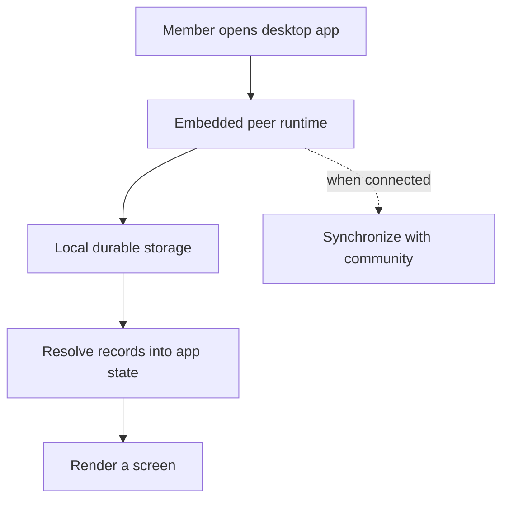

# Lesson 9: Your Desktop Has Local Data

The Peer Hours desktop application is not just a window around a remote website. It includes an embedded peer runtime with its own local storage and networking work.

## What you already know

Many web apps keep small local values in the browser: a theme choice, an access token, or a cached API response. The important business data still lives on the server.

## One new idea

In a local-first application, the local store can hold real application records, not merely a cache. The app can read records it already has even when it cannot currently contact a community node or another peer.



The dotted connection is important. Synchronization improves the local view; it is not the only way the desktop can show data.

## Small example

Suppose the desktop already has these records from yesterday:

```text
accepted proposal: Alice helps Bob for 60 minutes
settled transfer: Alice provided 60 minutes to Bob
```

Even if the laptop is offline this morning, it can still read those records and show the previously derived balances. It cannot safely settle a new shared exchange until the required people and records can connect and replicate.

## Peer Hours connection

The current desktop embeds `PeerRuntime`, which manages local peer behavior separately from the React user interface. The UI asks the runtime for network and record-core status rather than implementing networking inside components.

This is different from putting an optimistic API response into a browser cache. A local Peer Hours record is intended to be durable, verifiable, and capable of synchronizing with other runtimes.

Local data can be incomplete. If a desktop has not replicated a newly created record yet, it cannot show it. A local-first design prefers an honest partial view over pretending the app has fresh information when it does not.

## Takeaway

The desktop owns a real local runtime and durable data. Its UI should show what is locally known and be honest about whether it is current.

## Next lesson

Continue with [Lesson 10: What a community node does](10-community-node-responsibility.md).
