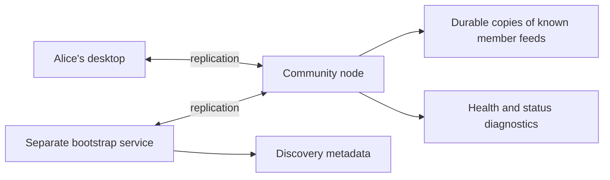

# Lesson 10: What a Community Node Does

A community node is always-available infrastructure operated for one Peer Hours community. It helps the community's records remain reachable when individual members close their desktop apps.

## What you already know

In client/server development, a server usually accepts requests, runs business logic, writes to a database, and returns responses. It is tempting to call a community node “the server.”

## One new idea

A community peer is availability and replication infrastructure, not automatically the sole authority over timebank truth. It keeps durable local storage, participates in peer discovery and replication, and reports health. A separate, minimal bootstrap service publishes onboarding metadata.

The node makes the network more dependable. It does not make a participant signature valid by itself, and it should not silently rewrite an exchange record.

## Small example

At midnight, no member desktop is open. The East Bay community peer can still remain discoverable and retain member feeds it already knows. When Alice opens her app in the morning, her runtime can find peers through the community discovery scope and replicate known member feeds.

If the node is temporarily unavailable, Alice's existing local records still exist on her device. She simply cannot use that node as a currently reachable synchronization partner.

## Peer Hours connection

The `apps/node` application is the current community-peer implementation. It maintains persistent Hypercore/Corestore data and exposes health, status, and opt-in local development simulator diagnostics. `apps/bootstrap` separately serves only configured discovery metadata at `GET /bootstrap`.

It does not own a writable shared record core. It is an always-on peer without a human attached: useful for availability and discovery, but not entitled to approve members, author their records, or decide validity.

Use the precise term **community node**: it describes its role in supporting a timebank community. A **peer** is any connected runtime, including a member desktop and the community node itself.

## Takeaway

A community peer makes replication and discovery more available. It does not host a canonical records API, approve members, or decide which valid-looking records count.

## Next lesson

Continue with [Lesson 11: What the bootstrap endpoint is for](11-bootstrap-endpoint.md).
