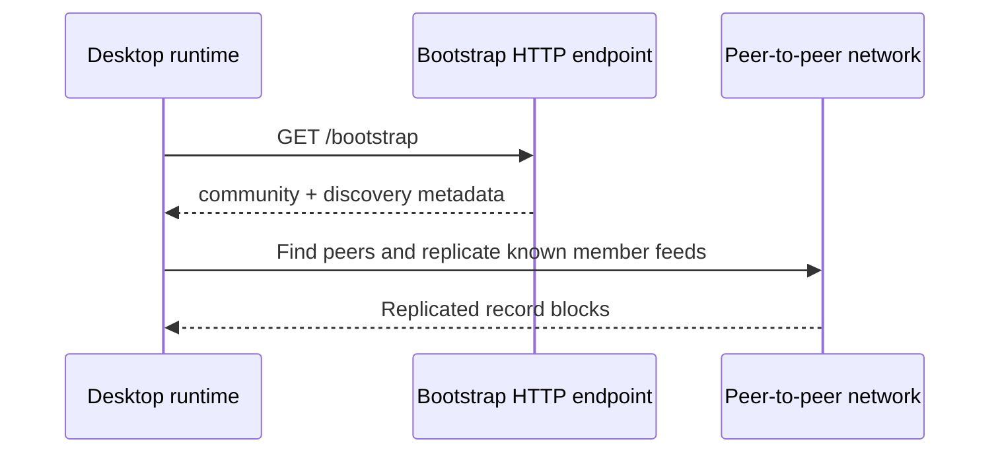

# Lesson 11: What the Bootstrap Endpoint Is For

A bootstrap endpoint is a small HTTP endpoint that gives a runtime enough public information to begin joining a community's peer-to-peer network.

## What you already know

You may have built an API endpoint such as `GET /api/projects`. A client calls it because it wants the latest project data from the server.

## One new idea

Peer Hours uses `GET /bootstrap` differently. The desktop asks for connection metadata, such as the community identity and discovery-core key. It then uses peer-to-peer tools to find peers and replicate known member feeds.



The endpoint is a map, not the destination.

## Small example

The current bootstrap response can include a value like this:

```json
{
  "communityId": "peer-hours/earth/US/CA/east-bay/oakland",
  "displayName": "Oakland Timebank",
  "protocolVersion": 1,
  "role": "bootstrap",
  "capabilities": ["discovery-metadata"],
  "coreKey": "64-character-public-discovery-core-key",
  "bootstrapNodes": [],
  "communityNodeUrl": "https://community-peer.example/status"
}
```

The long `coreKey` identifies the discovery core used to rendezvous with peers. It does not identify a community-owned history, and the bootstrap response does not contain timebank records or member-feed keys.

## Peer Hours connection

For development, the desktop commonly points at `http://127.0.0.1:10001/bootstrap`. The bootstrap service is deliberately separate from the deployed community peer: it serves configured discovery metadata but does not run Hypercore, Hyperswarm, member feeds, or record replication.

Bootstrap metadata must be treated carefully. It tells the runtime *what to try connecting to*; it does not itself prove that a transfer is valid, that a member is authorized, or that the node has every record.

The current runtime does more than just parse JSON. It requires a successful HTTP response and checks that the manifest has nonblank community information, a positive protocol version, correctly shaped 64-character core keys, and HTTP(S) bootstrap URLs. That catches many broken responses before the runtime uses them. It does **not** yet prove who operated the endpoint, pin a known key, or verify a signature. Think of it as checking that a map is readable without yet having a way to prove who printed the map.

This small HTTP bridge is useful because it lets a traditional desktop app discover a peer-to-peer community without hard-coding every network detail into the app.

## Takeaway

Bootstrap supplies a public starting map: one community scope and discovery key. It does not run the peer network, store member records, or decide record validity.

## Next lesson

Continue with [Lesson 12: Bootstrap is not central authority](12-bootstrap-is-not-central-authority.md).
