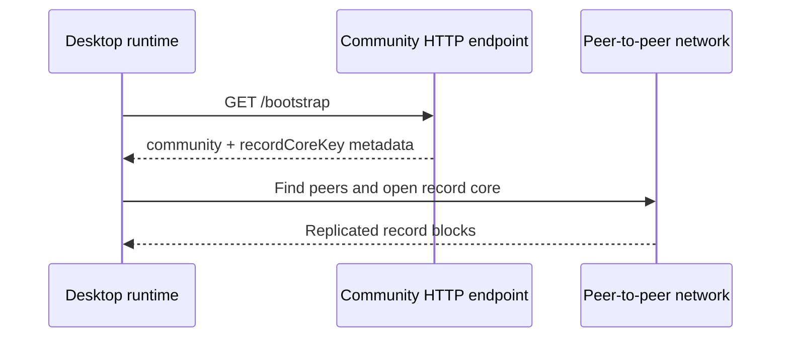

# Lesson 11: What the Bootstrap Endpoint Is For

A bootstrap endpoint is a small HTTP endpoint that gives a runtime enough public information to begin joining a community's peer-to-peer network.

## What you already know

You may have built an API endpoint such as `GET /api/projects`. A client calls it because it wants the latest project data from the server.

## One new idea

Peer Hours uses `GET /bootstrap` differently. The desktop asks for connection metadata, such as the community identity and record-core key. It then uses peer-to-peer tools to open and replicate the record core.



The endpoint is a map, not the destination.

## Small example

The current bootstrap response can include a value like this:

```json
{
  "community": {
    "id": "peer-hours/earth/US/CA/east-bay"
  },
  "recordCoreKey": "a1b2c3..."
}
```

The long `recordCoreKey` identifies a particular append-only record core. The desktop uses it to open the same core locally and replicate its records. It does not receive every timebank record directly inside the bootstrap response.

## Peer Hours connection

For development, the desktop commonly points at `http://127.0.0.1:10000/bootstrap`. A deployed community node can provide the same kind of public metadata from its own URL.

Bootstrap metadata must be treated carefully. It tells the runtime *what to try connecting to*; it does not itself prove that a transfer is valid, that a member is authorized, or that the node has every record.

The current runtime does more than just parse JSON. It requires a successful HTTP response and checks that the manifest has nonblank community information, a positive protocol version, correctly shaped 64-character core keys, and HTTP(S) bootstrap URLs. That catches many broken responses before the runtime uses them. It does **not** yet prove who operated the endpoint, pin a known key, or verify a signature. Think of it as checking that a map is readable without yet having a way to prove who printed the map.

This small HTTP bridge is useful because it lets a traditional desktop app discover a peer-to-peer community without hard-coding every network detail into the app.

## Next lesson

Continue with [Lesson 12: Bootstrap is not central authority](12-bootstrap-is-not-central-authority.md).
