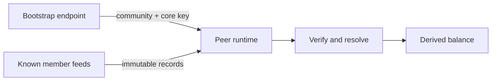

# Lesson 12: Bootstrap Is Not Central Authority

It is easy to see an HTTP URL and assume it is the central server that decides everything. In Peer Hours, bootstrap helps a runtime start networking; it is not meant to be the authority for every piece of timebank state.

## What you already know

In a conventional application, this is common:

```text
Client asks API for balance → API checks database → API returns the official balance
```

The API server is usually both the transport and the decision-maker.

## One new idea

Peer Hours separates jobs. Bootstrap shares public connection metadata. Replicated records carry facts. Local resolvers verify those records and derive state, such as a balance.



Bootstrap does not name a community record core. Even after peers exchange member-feed keys, a valid transfer still needs the correct proposal linkage, declared feed provenance, authorized keys, matching payload digest, and participant signatures.

## Small example

Imagine a response contains a record-core key. Two desktops use that key and receive this transfer record:

```text
Alice provided 60 minutes to Bob
```

Both desktops run the same validation rules. If the signatures are missing or the transfer does not match an accepted proposal, both should reject it from the derived ledger—even though they obtained it through the community network.

## Peer Hours connection

This is why the current packages are separated:

- `peer-runtime` handles local peer and member-feed behavior.
- `timebank-records` resolves immutable envelopes.
- `timebank-identity`, `timebank-settlement`, and `timebank-ledger` decide whether records can affect derived state.

The unresolved identity-lifecycle question is separate again: key rotation and recovery need a self-owned protocol. A reachable community peer is not, by itself, that policy.

## Takeaway

Bootstrap tells a runtime where to begin. Independent local validation tells it which replicated records are acceptable.

## Next lesson

Continue with [Lesson 13: What happens when the desktop starts](13-desktop-startup.md).
