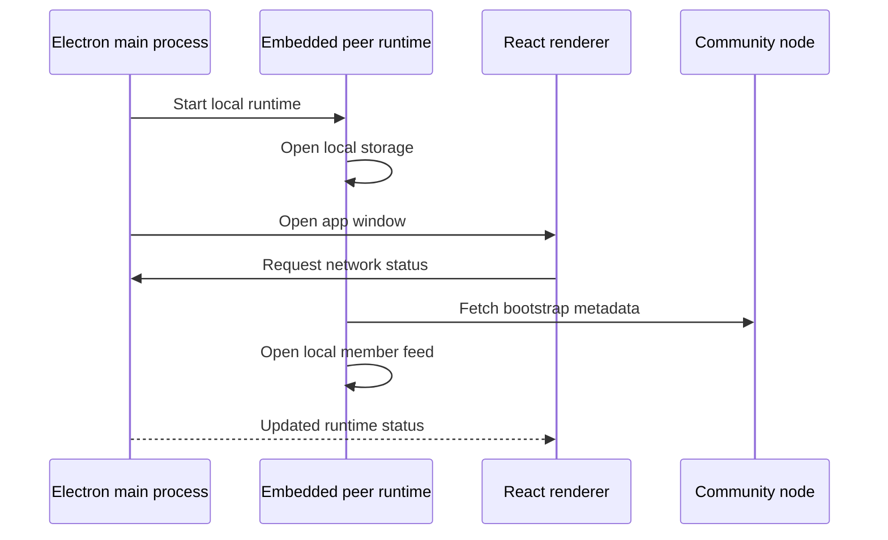

# Lesson 13: What Happens When the Desktop Starts

Starting the Peer Hours desktop starts more than a React page. Electron starts a desktop process, the embedded runtime prepares local networking and storage, and the renderer asks for status through a safe bridge.

## What you already know

For a browser app, startup often means: load JavaScript, render React, call an API, show a loading state, then render data.

## One new idea

Peer Hours can begin with local information before network information arrives. The runtime starts alongside the app, opens its local storage, and then attempts bootstrap and peer connectivity in the background.



The screen should not wait silently for a network request before it can explain what is happening.

## Small example

At first, a network panel might show:

```text
Local runtime: starting
Community node: checking bootstrap metadata
Record core: unavailable until a key is known
```

After bootstrap succeeds, it may update to:

```text
Local runtime: online
Community node: reachable
Record core: community core open, 12 records local
```

Those are meaningful stages, not just a spinner changing to “connected.”

## Peer Hours connection

The desktop has an Electron preload bridge so renderer code does not reach directly into Node networking APIs. It reads a status snapshot supplied by the main process and embedded runtime.

The exact visual layout will evolve, but the separation should remain: React presents state, Electron coordinates privileged desktop access, and `PeerRuntime` owns peer/network lifecycle. This keeps timebank rules and transport logic out of UI components.

## Next lesson

Continue with [Lesson 14: What it means to connect to a peer](14-peer-connection.md).
