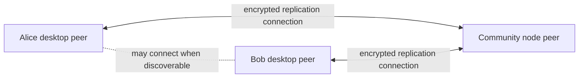

# Lesson 14: What It Means to Connect to a Peer

A peer connection is a live network relationship between two Peer Hours runtimes. It is not the same thing as “the website loaded,” and it is not necessarily a direct conversation between two members.

## What you already know

In a browser app, a successful `fetch` often means the client connected to the server, got a response, and finished. The connection may disappear immediately afterward.

## One new idea

Peer Hours peers can keep a live connection open so they can discover available data and replicate missing blocks. A community node is one possible peer. Another member desktop is also a peer when it is running and reachable.



The arrows mean “these runtimes can exchange known member-feed data.” They do not mean the community peer approves every exchange.

## Small example

Suppose Alice's desktop has blocks 0 through 8 from Bob's announced member feed, while the community peer has blocks 0 through 12 from that same feed. After they connect, Alice can request and verify the missing blocks 9 through 12.

```text
Alice local length:     9 blocks
Community local length: 13 blocks
After replication:      Alice has 13 blocks
```

This is replication: bringing an identified append-only history into sync. It is not a custom REST endpoint such as `GET /records?after=8`, even though the result may feel familiar.

## Peer Hours connection

Peer Hours uses peer networking to make local record histories converge. The desktop Network workspace can distinguish the community node from remote peers and show live peer counts.

A connection does not guarantee that every record is present, valid, or settled. It only says that a transport path currently exists between runtimes. The next lesson explains why that makes a single green “connected” label too vague.

## Takeaway

A peer connection makes exchange of known data possible. It says nothing by itself about completeness, trust, or settlement.

## Next lesson

Continue with [Lesson 15: Connection status is not a boolean](15-connection-status-is-not-a-boolean.md).
