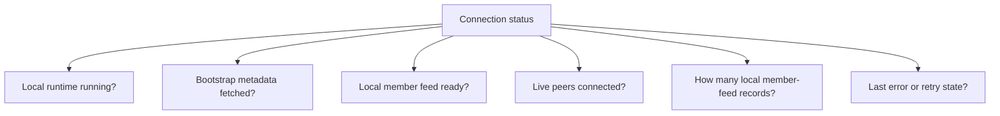
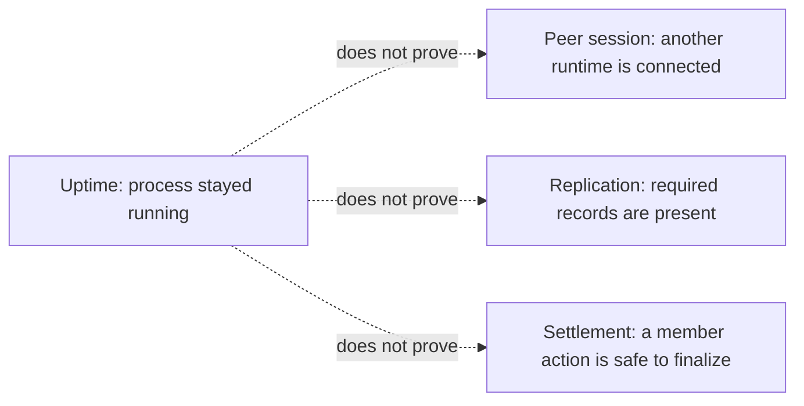

# Lesson 15: Connection Status Is Not a Boolean

“Connected” and “disconnected” are useful labels, but they hide important information in a local-first peer network. A desktop can be healthy in one way and incomplete in another.

## What you already know

Traditional web UIs often show a simple state:

```js
const isOnline = navigator.onLine;
```

That may be enough to decide whether to retry an API request. It does not explain whether the application has local data, knows its community, has a peer route, or has synchronized new records.

## One new idea

Peer Hours connection health is a group of facts. Treat it as a status object, not one boolean.



Each fact answers a different question. A desktop may have local records while offline. It may know the record-core key but currently have zero live peers. It may have a peer connection but still be downloading blocks.

## Small example

Compare these two states:

```text
A: runtime online, bootstrap fetched, member feed ready,
   0 live peers, 42 records local

B: runtime online, bootstrap failed,
   no discovery scope known, 0 live peers, 42 records local
```

Both can show yesterday's local data. State A is ready to synchronize when a peer appears. State B needs bootstrap configuration or a retry before it knows which discovery scope to join.

## Uptime is not the same as health

The current runtime reports when its `PeerRuntime` instance was created and its clock-derived uptime. That **uptime** number answers a useful but narrow question: “how long has this particular runtime instance existed?”



For example, a node may have been running for a week but have zero peers today. Or it may be freshly restarted and still have a complete local record history on disk. Uptime helps an operator spot restarts; it does not tell a member that their records are synchronized or their exchange is settled.

**Verified today:** `/status` includes `startedAt` and non-negative `uptimeMs` for the embedded runtime instance. `/health` remains a lightweight point-in-time check. Runtime uptime, external reachability history, replication freshness, and settlement acknowledgement remain separate signals; only the first is currently reported.

## A simulated dot is not a connection

During development, Peer Hours can register a simulated peer in the community node's status roster with an explicit `action: "register"` request. This lets a developer test a full peer list without waiting for many laptops to be online.

```text
source: "simulated"  -> test roster entry; do not infer replication
source: "hyperswarm" -> observed transport connection; replication still needs its own status
```

The simulator is useful, but it must stay visibly different from a real connection. Registration only works when both the local node and simulator explicitly set `ENABLE_DEV_PEER_REGISTRATION=true`; otherwise the node returns `404` and the simulator refuses to register. The route remains unauthenticated when enabled, so it is only safe for local development—not a way for a member or deployed node to announce itself in production.

## Peer Hours connection

The desktop Network workspace is intentionally a diagnostics view: it exposes community-node, peer, and record-core state separately. This avoids the misleading claim that a member is “fully connected” when only one narrow condition is true.

As Peer Hours grows, status can add sync progress, record lag, key-resolution health, and retry timing. Good status language builds trust because it tells members what the application knows, what it is doing, and what it cannot currently do.

## Takeaway

Connection is a collection of observable facts: local readiness, bootstrap state, peer availability, record freshness, and errors. A single green indicator cannot honestly represent all of them.

## Next lesson

Continue to [Lesson 16: What Is an Append-Only Log?](./16-append-only-log.md) to learn why Peer Hours records are added as history instead of edited in place.
