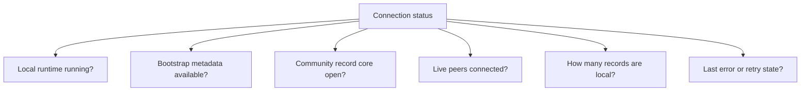

# Lesson 15: Connection Status Is Not a Boolean

“Connected” and “disconnected” are useful labels, but they hide important information in a local-first peer network. A desktop can be healthy in one way and incomplete in another.

## What you already know

Traditional web UIs often show a simple state:

```js
const isOnline = navigator.onLine;
```

That may be enough to decide whether to retry an API request. It does not explain whether the application has local data, knows its community, has a peer route, or has synchronized new records.

## One new idea

Peer Hours connection health is a group of facts. Treat it as a status object, not one boolean.



Each fact answers a different question. A desktop may have local records while offline. It may know the record-core key but currently have zero live peers. It may have a peer connection but still be downloading blocks.

## Small example

Compare these two states:

```text
A: runtime online, bootstrap fetched, record core open,
   0 live peers, 42 records local

B: runtime online, bootstrap failed,
   no community core known, 0 live peers, 42 records local
```

Both can show yesterday's local data. State A is ready to synchronize when a peer appears. State B needs bootstrap configuration or a retry before it even knows which community core to open.

## Peer Hours connection

The desktop Network workspace is intentionally a diagnostics view: it exposes community-node, peer, and record-core state separately. This avoids the misleading claim that a member is “fully connected” when only one narrow condition is true.

As Peer Hours grows, status can add sync progress, record lag, key-resolution health, and retry timing. Good status language builds trust because it tells members what the application knows, what it is doing, and what it cannot currently do.

## Next lesson

Continue to [Lesson 16: What Is an Append-Only Log?](./16-append-only-log.md) to learn why Peer Hours records are added as history instead of edited in place.
