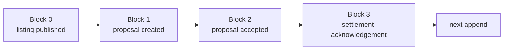

# Lesson 16: What Is an Append-Only Log?

An append-only log is an ordered list of facts that can grow but cannot revise an earlier entry. A [Hypercore](https://hypercore-protocol.org/) is an append-only log: every write creates a new numbered block at its end.

## What you already know

In a traditional application, a database table holds a current row. An append-only log instead preserves the sequence that led to a current view.



```text
index  fact
0      Alice publishes an offer for garden help
1      Bob proposes a 60-minute exchange
2      Alice accepts the proposal
```

**Expected observation:** appending block `2` does not replace blocks `0` or `1`. The log length becomes `3`, and every reader can still inspect the earlier facts.

Hypercore verifies that a received block belongs at its position in the particular log identified by its public key. It does **not** decide whether the JSON inside that block is a valid Peer Hours record.

## Peer Hours connection

`@peer-hours/peer-runtime` stores immutable JSON values in a named member feed through `HypercoreRecordStore`. The desktop app appends signed record envelopes there: member-feed declarations, published offers or requests, proposed and accepted exchanges, and settlement acknowledgements. A separate resolver (`@peer-hours/timebank-records`) decides which of those records are locally admissible.

So the log is durable evidence, not a mutable `balances` table and not a complete trust system. A useful screen is derived from the history it has locally verified.

## Takeaway

Think of a log as a timeline of claims. You add a new claim; you do not silently rewrite an old one.

## Next lesson

Continue to [Lesson 17: Why no in-place edits?](./17-no-in-place-edits.md).
