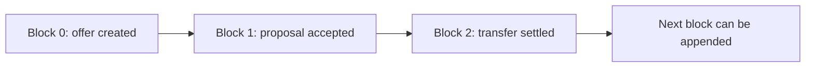

# Lesson 16: What Is an Append-Only Log?

An append-only log is a list of facts that can grow, but whose existing entries do not change. A Hypercore is an append-only log: each new piece of data is added at the end as a new block.

## What you already know

In a traditional application, you might add a row to a database table:

```sql
INSERT INTO offers (id, member_id, description)
VALUES ('offer-1', 'alice', 'Garden help');
```

An append-only log is closer to saving a sequence of events than maintaining a table. Its first concern is preserving the order and integrity of what was written, not answering application-specific queries.



## A tiny example

```text
index  record
0      offer.created: Alice offers garden help
1      proposal.accepted: Alice and Bob agree
2      transfer.settled: Bob receives 60 minutes of help
```

**Expected observation:** adding the third record does not replace either earlier record. The log length becomes `3`, and you can still read records `0` and `1`.

This is useful when a later screen needs to understand how it reached its current state. Instead of trusting only a final number, it can inspect the facts that produced it.

## Peer Hours connection

Peer Hours uses Hypercore storage through `@peer-hours/peer-runtime`. That runtime can open a named member feed and append or read immutable JSON records. Hypercore does not know what an offer, proposal, or transfer means. The meaning belongs to Peer Hours packages such as `@peer-hours/timebank-records` and the domain packages it composes.

An append-only log is not automatically a ledger, database, or trust system. It is the durable history that those higher-level rules can examine.

## Takeaway

Think of a log as a timeline of facts. You add a new fact; you do not silently rewrite an old one.

## Next lesson

Continue to [Lesson 17: Why no in-place edits?](./17-no-in-place-edits.md) to see why that restriction is useful once data is shared between peers.
