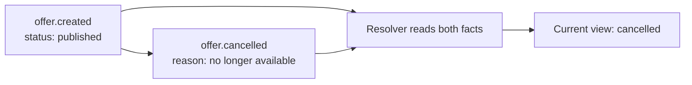

# Lesson 17: Why No In-Place Edits?

When one copy of data lives on one server, changing a row is straightforward. When several peers may hold copies, rewriting old history can make it difficult to tell which version is correct. Append-only systems represent a correction as a new fact.

## What you already know

In a client/server app, an update might look like this:

```sql
UPDATE offers
SET status = 'cancelled'
WHERE id = 'offer-1';
```

The database server is the one authority that decides which value is current. In a replicated system, Alice's computer and a community node may be offline at different times. A new record travels more safely than a rewrite of an old block.



## A tiny example

```text
0  listing.created   { id: "offer-1", description: "Garden help" }
1  listing.published { id: "offer-1" }
2  listing.cancelled { id: "offer-1" }
```

**Expected observation:** a screen that reads all three records should show the offer as cancelled. It should not delete records `0` or `1`; they explain what happened before cancellation.

This pattern does not mean every change is valid. The application rules decide whether a member is allowed to cancel a listing and how conflicting records are handled. The storage layer simply preserves the evidence.

## Peer Hours connection

The current `@peer-hours/timebank-records` package reduces immutable record histories into a useful resolved view. Its envelope reducer can safely accept an identical record delivered twice, but rejects two different records that claim the same record ID. That protects the basic history from ambiguous replay.

For the current implementation, most timebank record types are still being connected to live member workflows. The design lesson is already active: derived state should come from a traceable record history, rather than a mutable balance or status field alone.

## Takeaway

“Current state” is a conclusion made from history. A correction is another record, not an erased past.

## Next lesson

Continue to [Lesson 18: What is a Hypercore key?](./18-hypercore-key.md).
