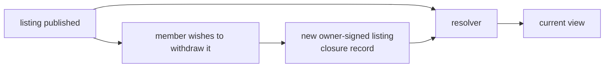

# Lesson 17: Why No In-Place Edits?

When multiple peers can retain a copy of a history, rewriting an old fact makes it harder to explain or verify what happened. Append-only systems represent a correction or a new phase as another fact.

## A timeline, not a mutable row



The current desktop workflow models another common transition this way. A pending proposal and its later acceptance are distinct signed records. The acceptance does not mutate the proposed record; the resolver checks that its offer, request, participants, and minutes preserve the original immutable terms.

```text
proposed proposal:  60 minutes, Alice provides, Bob receives
accepted proposal:  60 minutes, same listings and participants, accepted by Bob
```

**Expected observation:** a forged “acceptance” that changes the minutes or participants is rejected during local resolution. Keeping both records makes the relationship inspectable.

## What this does and does not solve

Appending protects the past from silent edits, but it does not make every later claim valid. Peer Hours checks envelope shape, member signatures, feed provenance, community scope, and workflow-specific rules. A listing owner can now publish an immutable closure that removes that listing from new-proposal availability after replication; it does not erase the listing or cancel already proposed or accepted exchanges. Editing and cancellation semantics remain future policy work.

## Peer Hours connection

The resolver accepts an identical replay once but rejects different envelopes with the same record ID. It also keeps a raw-record view separate from the verified resolved state. That distinction is important: history can contain malformed or unauthorized claims without turning them into current state.

## Takeaway

“Current state” is a conclusion drawn from history. A correction should be another traceable record, not an erased past.

## Next lesson

Continue to [Lesson 18: What is a Hypercore key?](./18-hypercore-key.md).
