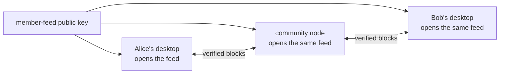

# Lesson 18: What Is a Hypercore Key?

A Hypercore public key identifies one exact append-only log. If two peers open the same key, they can exchange and verify blocks for that same history.



## What a key is not

A key identifies data, not a web-server address, a member identity, or permission to write. It is normally shown as 64 hexadecimal characters, although the protocol works with binary key material.

```text
member feed key:  ab12...ef90
```

**Expected observation:** every peer that opens this public key refers to the same ordered feed, while each stores its own local copy. A remote opener is read-only; only the runtime with the feed’s private writer material can append.

## Peer Hours connection

`PeerRuntime` exposes the local member feed’s `coreKey` in its status. A signed, short-lived member-feed announcement tells connected peers that a particular member, community, and feed key belong together. Peers validate and cache those announcements before opening discovered remote feeds.

That feed key remains distinct from the member’s root signing key. The feed key says **which Hypercore history**; the root signing key helps the resolver answer **which member signed a record**. Neither key turns a community node into a central authority.

## Takeaway

A Hypercore key answers “which immutable history?” Discovery answers “how might I reach a peer carrying it?” and Peer Hours authorization answers “should this record count?”

## Next lesson

Continue to [Lesson 19: What is Corestore?](./19-corestore.md).
