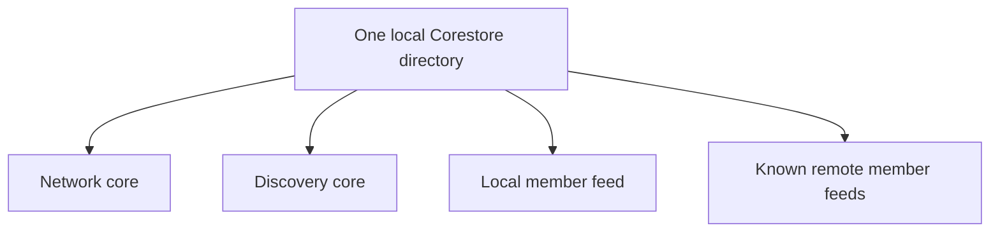

# Lesson 19: What Is Corestore?

Corestore is local storage that manages a collection of Hypercores. A Peer Hours runtime uses one Corestore directory as the home for the logs it opens and replicates.

## What you already know

In a web application, you might configure one database connection and create many tables inside that database. Corestore is not a relational database, but the mental model is helpful: it is one local storage home that can manage many separate logs.



Each core still has its own public key, ordered blocks, and replication behavior. Corestore gives the runtime a convenient place to open, persist, and replicate them together.

## A tiny example

```text
app-data/
  corestore/
    network core
    timebank record core
```

Imagine starting the desktop app twice with the same app-data directory.

**Expected observation:** the second start can reopen the same local cores and read records already downloaded during the first start. It does not need to fetch every record again before showing locally available information.

The exact files on disk are Corestore implementation details. Applications should treat the data directory as runtime state, not as a folder for manually editing records.

## Peer Hours connection

`@peer-hours/peer-runtime` creates and owns an application-supplied Corestore. It opens a local discovery core and, for a member runtime, a named `peer-hours-member-records` feed through `HypercoreRecordStore`. After a valid signed feed announcement, it can open a known remote member feed too. When it receives a replication connection, it replicates the Corestore, allowing the other runtime to exchange blocks for cores both sides have opened.

Corestore does not decide which records should be trusted or how a balance is calculated. `@peer-hours/timebank-records` and the pure timebank packages do that after records arrive locally.

## Takeaway

Corestore is the local container for many Hypercores. It makes a runtime’s replicated data durable across restarts.

## Next lesson

Continue to [Lesson 20: What is replication?](./20-replication.md).
