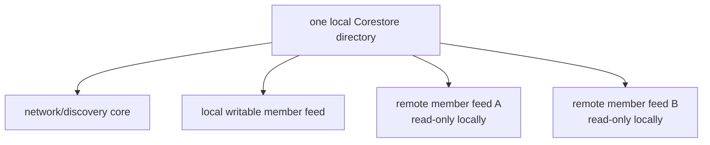

# Lesson 19: What Is Corestore?

[Corestore](https://github.com/holepunchto/corestore) is a local storage manager for a collection of Hypercores. One Peer Hours runtime gives it a directory and uses it to persist the logs it owns or has opened from other peers.



Each core still has its own key, ordered blocks, and writer permissions. Corestore is not a relational database, a global shared disk, or a source of timebank policy; it is the local home that lets a runtime reopen available data after restart.

## A concrete restart example

```text
first start:  replicate a known remote member feed to local Corestore
restart:      reopen the local Corestore and read its available blocks immediately
later:        connect again and receive any missing blocks
```

**Expected observation:** a restart can show a locally available history before the network is reachable. The app should treat the Corestore directory as runtime state, not manually edit its internal files.

## Peer Hours connection

`PeerRuntime` opens `peer-hours-network` for discovery and, for a member runtime, a writable `peer-hours-member-records` Hypercore. Once a valid member-feed announcement is known, it can open that feed key as a remote read-only record store in the same Corestore. Corestore replication exchanges blocks for cores both connected peers have opened.

`@peer-hours/timebank-records` runs after this storage layer. It decides whether locally stored envelopes form authorized listings, proposals, acknowledgements, or ledger entries; Corestore does not.

## Takeaway

Corestore makes a runtime’s collection of local and replicated Hypercores durable. It does not merge them into one authority or decide their business meaning.

## Next lesson

Continue to [Lesson 20: What is replication?](./20-replication.md).
