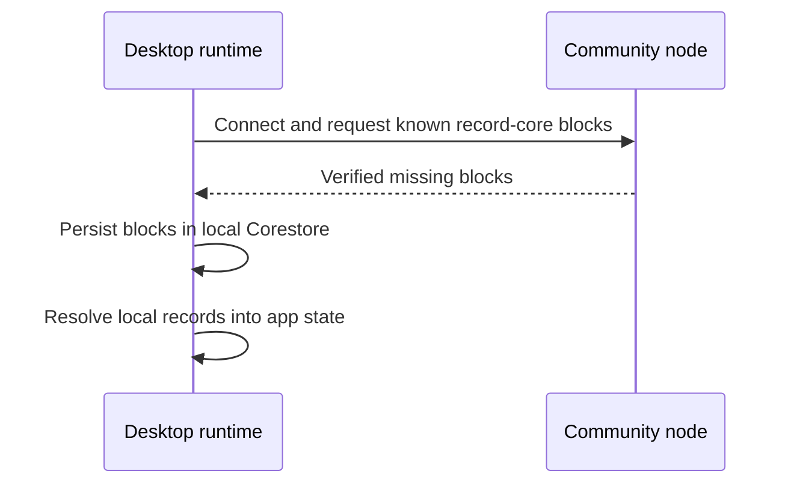

# Lesson 20: What Is Replication?

Replication is the process of copying verified blocks of the same Hypercore between connected peers. It lets each runtime build a local copy of the history it needs.

## What you already know

With a REST API, a browser often asks a server for the latest data:

```text
GET /records
→ server sends JSON response
```

With replication, two runtimes exchange blocks for a known core. Each runtime stores received blocks locally, so the next screen can read local data instead of treating every view as a fresh server request.



## A tiny example

```text
Alice's member feed: blocks 0, 1, 2
Desktop before connection: blocks 0, 1
Desktop after replication: blocks 0, 1, 2
```

**Expected observation:** the desktop now reads block `2` from its own local Corestore. It did not need to trust a JSON response as the only record of the fact; Hypercore verifies the block belongs to the core identified by its key.

Replication is not the same as business validation. A replicated transfer can be structurally well-formed yet still be rejected by Peer Hours rules because its signatures, proposal linkage, or authorization are invalid.

## Peer Hours connection

`HypercoreRecordStore` in `@peer-hours/peer-runtime` has a two-Corestore integration test: one runtime appends an immutable record to its member feed, another opens that feed key, replication runs, and the second reads the equivalent record sequence. The always-on community peer has no special writer role; it can retain the same known feed like any other peer.

That is a real replication path, but it is not yet member-originated writing or a full distributed authority model.

## Takeaway

Replication makes a verified local copy. It does not by itself decide what the copied data means or whether the community should accept it.

## Next lesson

Continue to [Lesson 21: What happens when a peer is offline?](./21-offline-peers.md).
