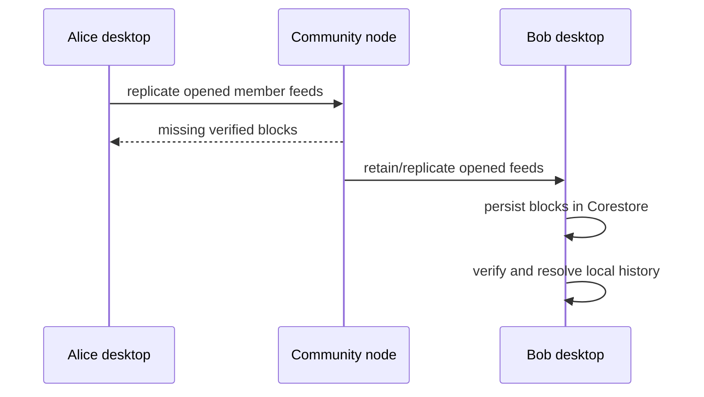
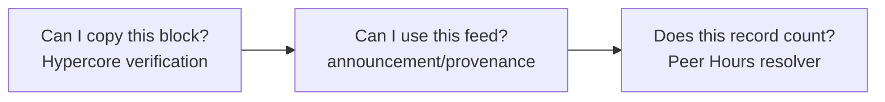

# Lesson 20: What Is Replication?

Replication copies verified missing blocks of a known Hypercore between connected peers. Each runtime persists the blocks it receives locally, then reads and resolves that local snapshot.



## A tiny example

```text
Alice feed:              blocks 0, 1, 2
Bob's local copy before: blocks 0, 1
Bob's local copy after:  blocks 0, 1, 2
```

**Expected observation:** Bob can read block `2` from his own Corestore after replication. Hypercore verifies that the block belongs to Alice’s feed key; Bob does not have to treat an HTTP JSON response as the only evidence of the claim.

## Three separate questions



Replication is not business validation, authorization, or finality. A replicated record may still be discarded from the resolved view because it has an invalid signature, the wrong community, an undeclared feed, or terms that violate the protocol. Conversely, a locally accepted record is not proof that every community peer has received it yet.

## Peer Hours connection

`PeerRuntime` replicates its Corestore over Hyperswarm connections. Its integration tests cover appending an immutable member-feed record in one runtime, opening the feed by public key in another, replicating, and reading the equivalent sequence. Community nodes can be always available retainers of opened feeds, but they have no privileged writer role and do not expose a canonical `/records` API.

## Takeaway

Replication gives a peer a verified local copy of a feed. The Peer Hours resolver decides what that copy means.

## Next lesson

Continue to [Lesson 21: What happens when a peer is offline?](./21-offline-peers.md).
