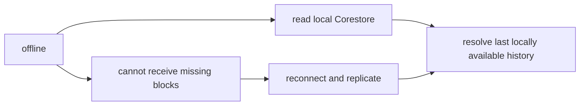

# Lesson 21: What Happens When a Peer Is Offline?

An offline peer retains the records it has already stored. It cannot receive newly replicated records until it reconnects, but local history does not disappear with the network.



```text
09:00  desktop has records 0–12 and is online
09:05  connection drops; it can still read records 0–12
09:20  it reconnects and receives records 13–15
```

**Expected observation:** the locally derived view remains available at 09:05, but it may be stale. After reconnection the runtime resolves the larger local history again.

## Important boundaries

Offline does not permit a member to manufacture a counterparty’s signature or acknowledgement. A member can only append to their own writable feed. An exchange requires records from more than one participant, and the resolver will not treat a lone acknowledgement as dual confirmation.

Likewise, “dual-confirmed” is not a statement that all peers have replicated the records. In the current protocol it means the local resolver found both valid participant acknowledgements for the accepted proposal. Replication visibility and any stronger finality policy are separate concerns.

## Peer Hours connection

The desktop Network workspace shows runtime and record-core status, while its Records workspace presents a last valid resolved snapshot, loading/retry states, and raw records separately. Member-facing offline composition is intentionally limited: listing publication and proposal/settlement actions require the protected local identity and a configured community scope; current connectivity affects when other peers can learn about them.

## Takeaway

Offline means “work from the history already on this device.” It does not mean “the history is current everywhere” or “a multi-party exchange is complete.”

## Next lesson

Continue to [Lesson 22: What is a record envelope?](./22-record-envelope.md).
