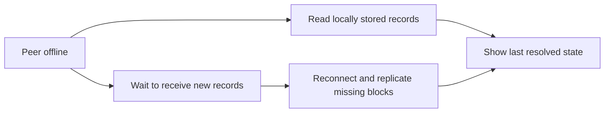

# Lesson 21: What Happens When a Peer Is Offline?

An offline peer keeps the records it already has. It cannot receive new records or participate in an online interaction until it reconnects, but its local data does not disappear just because the network is unavailable.

## What you already know

In a browser-only app, a failed API request often means the screen cannot load current data. You may show a spinner, error, or empty state because the server response is missing.

In a local-first runtime, the app can first read its local Corestore. Network availability affects freshness, not whether all known history suddenly ceases to exist.



## A tiny example

```text
At 9:00: desktop has records 0–12 and is online.
At 9:05: internet drops; desktop still has records 0–12.
At 9:20: it reconnects and downloads records 13–15.
```

**Expected observation:** while offline, the app can display information derived from records `0–12`, ideally marked with its connection or freshness status. After reconnecting, it resolves the expanded local history and updates the view.

Offline does not grant magic powers. A member cannot complete a workflow that requires another participant’s online attestation merely by changing a local screen. Peer Hours intentionally treats transaction settlement as an online, verifiable interaction.

## Peer Hours connection

The `PeerRuntime` status snapshot distinguishes runtime state and peer freshness. The desktop Network workspace reports connection and record-core availability so a user or developer can see whether the runtime is working from local records or is connected to community infrastructure.

Peer Hours aims to let people draft or post needs and offers with local-first behavior, while signed settlement records must be exchanged and verified online. The exact member-facing offline workflow is still future work.

## Takeaway

Offline means “working from the history you already have,” not “the system has forgotten everything” and not “new shared settlement is complete.”

## Next lesson

Continue to [Lesson 22: What is a record envelope?](./22-record-envelope.md).
