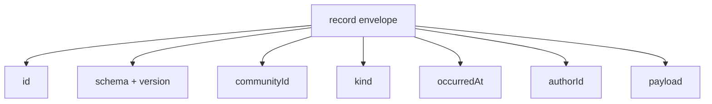
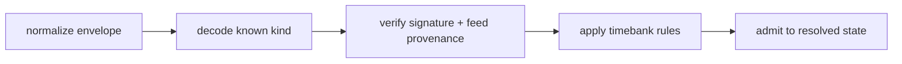

# Lesson 22: What Is a Record Envelope?

A record envelope is the common JSON wrapper around a type-specific Peer Hours fact. It gives a replicated record enough metadata to be checked, de-duplicated, scoped, and routed to its decoder before domain rules inspect the payload.



## A representative shape

```json
{
  "id": "listing-42",
  "schema": "peer-hours/timebank-record/v1",
  "version": 1,
  "communityId": "peer-hours/earth/US/CA/east-bay",
  "kind": "peer-hours/published-listing/v1",
  "occurredAt": "2026-07-18T12:00:00.000Z",
  "authorId": "alice",
  "payload": { "id": "listing-42", "kind": "offer", "title": "Garden help", "minutes": 60 }
}
```

**Expected observation:** a reader can reject malformed metadata or non-JSON payloads before interpreting a listing. An identical replay of the complete normalized envelope is harmless; two different envelopes claiming the same ID are a conflict, not a choice for the UI to make.

## Envelope is not trust

The envelope answers basic structural questions. It does not prove the author owns the feed, that the record has a valid member signature, or that the proposed business transition is allowed.



## Peer Hours connection

`@peer-hours/timebank-records` creates normalized, deep-frozen envelopes and reduces an unordered history deterministically. It maps supported kinds for member-feed declarations, published listings, pending and accepted exchange proposals, settlement acknowledgements, and transfers. The main process signs member-authored records; the resolver validates signatures and authorization before they can affect verified state.

## Takeaway

An envelope is a consistent transport shape. It makes a record inspectable, but it is not itself a signature, authorization decision, or settlement.

## Next lesson

Continue to [Lesson 23: What is a record core?](./23-record-core.md).
