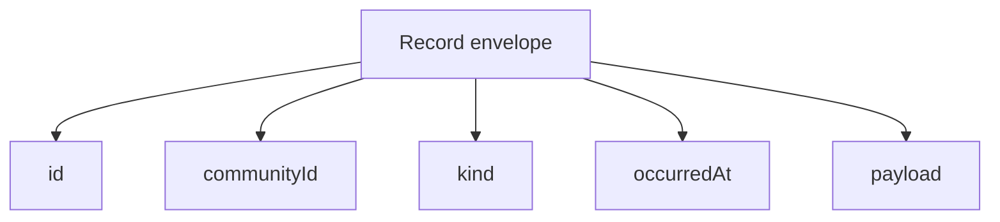

# Lesson 22: What Is a Record Envelope?

A record envelope is a small, consistent wrapper around a record’s actual payload. It gives every replicated fact enough shared metadata to be identified, scoped, ordered, and safely replayed.

## What you already know

An HTTP API often returns a JSON object designed for one endpoint:

```json
{ "id": "offer-1", "description": "Garden help" }
```

In a replicated log, different record types travel together. A common envelope makes it possible to inspect a record before the application interprets its type-specific contents.



## A tiny example

```json
{
  "id": "proposal-42",
  "communityId": "peer-hours/earth/US/CA/east-bay",
  "kind": "timebank.accepted-proposal.v1",
  "occurredAt": "2026-07-18T12:00:00.000Z",
  "payload": { "proposalId": "proposal-42", "minutes": 60 }
}
```

**Expected observation:** a reader can reject this record if its ID, community ID, kind, or timestamp is malformed before it tries to use the proposal payload. Two identical deliveries of this envelope can be reduced to one. Two different envelopes using `proposal-42` as the same record ID are a conflict and must be rejected.

## Peer Hours connection

`@peer-hours/timebank-records` implements `createRecordEnvelope` and `reduceRecordEnvelopes`. It validates the required metadata, accepts only JSON-compatible payloads, deep-freezes normalized records, and reduces an unordered history deterministically. It then maps recognized record kinds into identity lifecycle events, accepted proposals, and ledger transfers.

An envelope is not a signature and does not establish trust. It is a reliable transport shape. Signatures and authorization checks happen in the identity and settlement layers after the record is decoded.

## Takeaway

The envelope answers basic questions—what is this, which community is it for, and is this a duplicate—before business rules inspect the payload.

## Next lesson

Continue to [Lesson 23: What is a record core?](./23-record-core.md).
