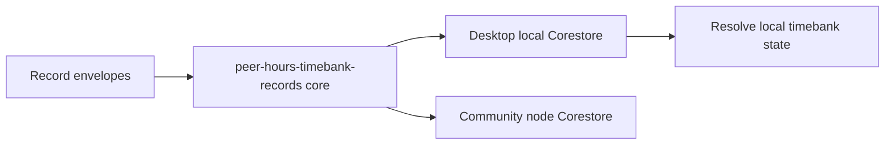

# Lesson 23: What Is a Record Core?

A member feed is the named Hypercore used to store one Peer Hours member's record envelopes. It is the bridge between low-level replicated storage and the timebank records that the application can resolve into useful state.

## What you already know

You may think of a database table such as `events` that holds many types of application activity. A member feed plays a related role, but it is an append-only, replicated sequence owned by one peer rather than a centrally updated table.



## A tiny example

```text
member feed: peer-hours-member-records

block 0: member-signing-key activation envelope
block 1: accepted-proposal envelope
block 2: signed-transfer envelope
```

**Expected observation:** after a runtime has replicated these blocks, `@peer-hours/timebank-records` can read the envelopes in any arrival order, reduce duplicates, resolve active keys, verify the transfer, validate it against the proposal, and derive a balance. It does not need a mutable `balances` table to be the source of truth.

## Peer Hours connection

`@peer-hours/peer-runtime` opens the named `peer-hours-member-records` feed using `HypercoreRecordStore`. Every runtime owns its own writable version. A community peer may retain and replicate a known feed, but does not advertise a canonical record key or expose a `/records` endpoint.

This is verified current behavior. It has important limits: the desktop does not yet publish its signed application records or announce its feed to other peers, and key rotation is not yet designed. The member feed is real shared infrastructure, not the completed timebank protocol.

## Takeaway

Together, known member feeds form the shared history. Resolver packages turn those histories into proposals, verified transfers, and balances.

## Next lesson

Continue to [Lesson 24: Raw Records Versus a Useful Screen](24-raw-records-and-useful-screens.md), which introduces the resolver: how raw envelopes become a deterministic Peer Hours view without treating the UI or a server response as the source of truth.
