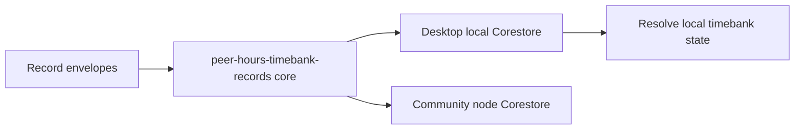

# Lesson 23: What Is a Record Core?

A record core is the named Hypercore used to store Peer Hours record envelopes. It is the bridge between low-level replicated storage and the timebank records that the application can resolve into useful state.

## What you already know

You may think of a database table such as `events` that holds many types of application activity. A record core plays a related role, but it is an append-only, replicated sequence rather than a centrally updated table.



## A tiny example

```text
record core: peer-hours-timebank-records

block 0: member-signing-key activation envelope
block 1: accepted-proposal envelope
block 2: signed-transfer envelope
```

**Expected observation:** after a runtime has replicated these blocks, `@peer-hours/timebank-records` can read the envelopes in any arrival order, reduce duplicates, resolve active keys, verify the transfer, validate it against the proposal, and derive a balance. It does not need a mutable `balances` table to be the source of truth.

## Peer Hours connection

`@peer-hours/peer-runtime` opens the named `peer-hours-timebank-records` core using `HypercoreRecordStore`. A community node currently creates and owns the writable version, advertises its public key in bootstrap metadata, and offers a read-only `/records` diagnostic endpoint. Desktop runtimes use that advertised key to open and replicate the community record core as readers.

This is verified current behavior. It has important limits: desktop members cannot yet append their own timebank records, authorization events are not yet governed by a fully signed community-authority model, and multiwriter feeds are not yet designed. The record core is real shared infrastructure, not the completed timebank protocol.

## Takeaway

The record core stores the shared history. Resolver packages turn that history into proposals, verified transfers, and balances.

## Next lesson

Continue to [Lesson 24: Raw Records Versus a Useful Screen](24-raw-records-and-useful-screens.md), which introduces the resolver: how raw envelopes become a deterministic Peer Hours view without treating the UI or a server response as the source of truth.
