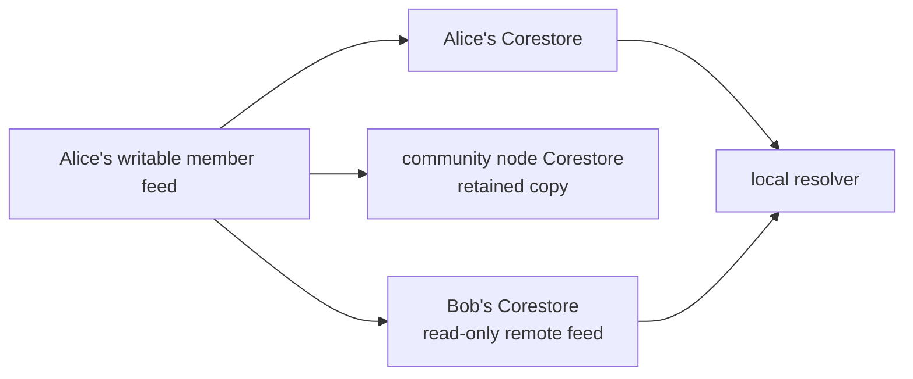
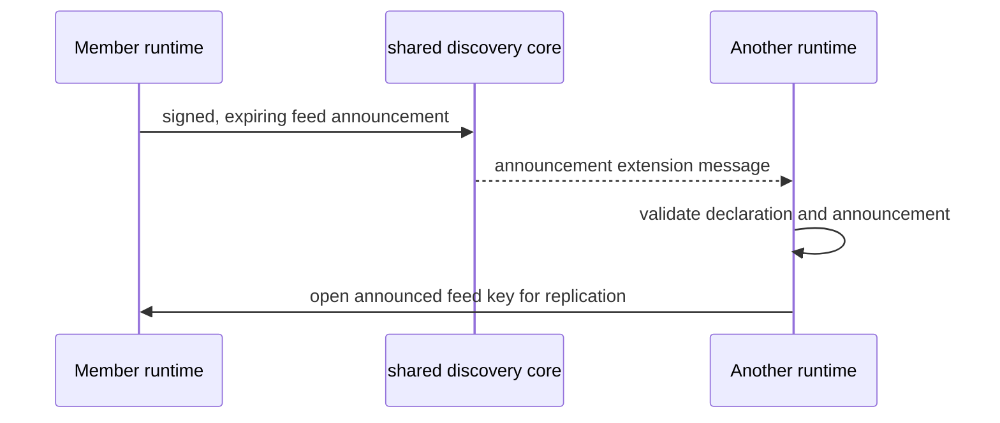

# Lesson 23: What Is a Record Core?

A **member feed** is the named Hypercore that one Peer Hours runtime writes for its member-owned record envelopes. A record core is the storage bridge between immutable low-level blocks and the timebank resolver.



## A concrete feed

```text
named local feed: peer-hours-member-records

block 0  member-feed declaration
block 1  published offer
block 2  proposed exchange
block 3  settlement acknowledgement
```

**Expected observation:** an owner can append to this feed; a peer that opens its public key can only read and replicate its available blocks. One feed alone is not the whole community history: the desktop resolves the local feed together with discovered, declared member feeds in the same community.

## Discovery is deliberately separate



An announcement is scoped to a community and expires. It helps a runtime learn which feed to open; it is not a canonical record feed and does not let a community node choose a member’s identity, balance, or truth.

## Peer Hours connection

The current desktop can create its self-owned protected identity, append signed listing/proposal/acceptance/acknowledgement records to its member feed, and resolve records from its own plus discovered feeds. The resolver provenance-checks member-feed declarations so copied blocks from an undeclared or mismatched feed cannot simply become usable timebank history.

The current implementation supports root-signed overlapping device-key rotation and permanent revocation through the declared member feed. It still does not claim replication finality: a valid local view and even a retention receipt are not an irreversible social outcome.

## Takeaway

Known member feeds provide the raw shared history. They are independently writable histories, not a single community-owned database.

## Next lesson

Continue to [Lesson 24: Raw Records Versus a Useful Screen](./24-raw-records-and-useful-screens.md).
