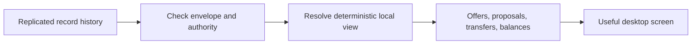

# Lesson 24: Raw Records Versus a Useful Screen

A replicated record is not yet a screen a member can understand. A Peer Hours app needs a repeatable way to turn raw, append-only records into a useful local view: known signing keys, current offers, accepted proposals, valid transfers, and derived balances.

## What you already know

In a typical web application, the server may query database tables and send the browser a ready-made JSON response:

```text
GET /api/balance/me  ->  { "minutes": 120 }
```

In a local-first system, a runtime can receive individual records in a different order, or receive the same record more than once. The screen should not trust arrival order or a node's current response as the source of truth. It should resolve the immutable history it has locally.



## One small example

Imagine a runtime has these three records:

```text
1. Member A's key is authorized for East Bay
2. A proposal between Member A and Member B is accepted for 60 minutes
3. The accepting member authors the signed accepted-proposal record
4. Either transfer participant submits a signed transfer record, carrying a dual-attested transfer that refers to that accepted proposal
```

The resolver checks that the key was valid, that the proposal was accepted, and that the transfer exactly matches the proposal. If it does, it derives `+60` minutes for A and `-60` minutes for B. If record 3 arrives before records 1 and 2, the runtime can keep it as unresolved and try again when the rest of the history arrives. It must not invent a settled balance just because it saw a transfer-shaped object.

**Expected observation:** compatible complete histories produce the same view even if records arrived in a different order or a duplicate was replayed.

## Peer Hours connection

`@peer-hours/timebank-records` already tests deterministic in-memory resolution of compatible record envelopes into authorizations, accepted proposals, verified transfers, and derived balances. Proposal and transfer envelopes must now also carry a valid active member signature before the resolver admits them. That is a verified package-level capability.

The running desktop does **not** yet resolve and display member offers, proposals, or balances from the community record core. The live record core is generic, community-owned, and read-only to desktop members. Connecting the resolver to an authorized member-write protocol and member-facing screens is proposed future work.

## Takeaway

Replication gives a runtime a history. Resolution turns that history into a view a person can use. The resolver must be stricter than the screen: an attractive number is not a balance unless valid records support it.

## Next lesson

Continue with [Lesson 25: Who is allowed to author a record?](25-who-authors-a-record.md).
