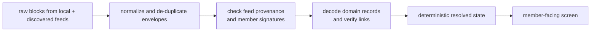

# Lesson 24: Raw Records Versus a Useful Screen

A replicated record is not automatically a fact the application should show as accepted. Peer Hours turns raw immutable records into a **verified local view** by validating and resolving the history available on this device.



## One exchange, in stages

```text
1. Alice publishes an offer; Bob publishes a compatible request.
2. Alice or Bob signs a pending proposal from those listings.
3. The other participant signs an acceptance with identical terms.
4. Each participant may sign a settlement acknowledgement.
5. Only a valid, dual-attested settlement transfer can be admitted to the local ledger.
```

**Expected observation:** receiving step 4 before the proposal, or receiving only one acknowledgement, does not create a settled balance. The resolver may keep a record unavailable to the useful view until the required linked history is present and valid. Complete compatible histories resolve to the same result despite delivery order and identical replays.

## Raw and resolved views answer different questions

| View | Question it answers | Must not imply |
| --- | --- | --- |
| Raw records | “What bytes/JSON did this runtime read from opened feeds?” | That every record is valid or authorized |
| Resolved state | “Which facts did local rules accept from this snapshot?” | That every peer has replicated them or that stronger finality is reached |

The desktop deliberately keeps raw inspection separate and presents loading, retry, and last-valid-snapshot behavior around resolved state. That helps a user distinguish an unavailable/rejected refresh from a verified zero balance.

## Peer Hours connection

`resolveTimebankMemberFeeds` combines feed histories only after checking declaration provenance, then `resolveTimebankRecords` validates envelopes, signatures, identity authorization, listing/proposal linkage, settlement acknowledgements, and ledger admission. The Electron main process sends a small renderer-safe projection of that result to the untrusted UI; it does not ask the renderer to decide which records count.

At present, a dual-confirmed acknowledgement remains distinct from a locally ledger-admitted settlement, and neither phrase claims network-wide replication finality. This is an intentional safety boundary, not a cosmetic wording choice.

## Takeaway

Replication provides history. Resolution provides a locally verified interpretation. A polished screen must never blur the difference.

## Next lesson

Continue with [Lesson 25: Who is allowed to author a record?](./25-who-authors-a-record.md).
