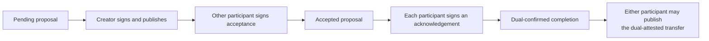

# Lesson 25: Who Authors a Record—and Who Agrees With It?

Peer Hours deliberately separates two questions that are easy to blur:

1. **Who appended this immutable statement to their member feed?** That member is the record author.
2. **Whose agreement does the statement require before it counts?** That depends on the record type.



## One exchange, several authorship rules

Alex offers gardening; Bri requests it. Alex creates the pending proposal, so the proposal record must be signed by Alex. Bri—not Alex—must sign the later acceptance record. The acceptance preserves every proposal term; it is not a mutable edit of Alex’s record.

After the work, Alex and Bri may each publish their own acknowledgement. An acknowledgement is signed by the participant named as `acknowledgedByMemberId`. Once both acknowledgements resolve, either participant may publish the settlement-transfer envelope. That envelope is still admitted only when it contains **both** participants’ valid attestations over the exact transfer terms.

```text
record author       answers: “who published this record?”
transfer attestor   answers: “who approved these transfer terms?”
ledger admission    answers: “does this locally verified transfer count?”
```

**Expected observation:** Alex can publish a transfer envelope, but it is rejected if Bri’s required attestation is absent, invalid, or signs different terms.

## Peer Hours connection

The records resolver verifies authorized member signatures and enforces provenance: proposal creator, accepting counterparty, acknowledgement participant, or transfer participant. The settlement package separately checks dual confirmation and both cryptographic transfer attestations. Neither check claims that every peer has replicated the records or that the exchange is globally final.

## Takeaway

Record authorship tells us who made a statement available. Participant attestations tell us who agreed to a settlement. Both matter, and neither is a community administrator’s approval.

## Next lesson

The next lesson explains why those rules must produce the same result even when records arrive in different orders.
