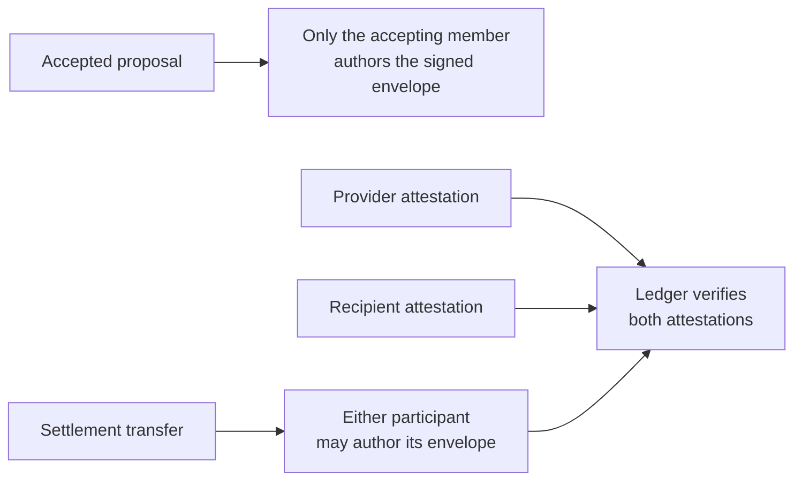

# Lesson 25: Who Is Allowed to Author a Record?

“Signed” can mean two different things in Peer Hours. A record envelope has an **author**: the member whose key signed the complete immutable record before it entered replicated history. A settlement transfer also has **attestations**: the provider and recipient each sign the transfer terms to show that both agree.

## One small example

Alex proposes to give Bri 60 minutes of gardening help. Bri accepts. The accepted-proposal record must be authored by Bri, because Bri performed the acceptance. Alex cannot publish a valid acceptance record for Bri.

After the work is complete, Alex and Bri both attest to a 60-minute transfer. Either Alex or Bri may author the record envelope that carries that transfer into history. The resolver accepts that envelope only if its author is a participant, and the ledger derives balances only if **both** participant attestations verify.

**Expected observation:** a transfer envelope signed only by Alex still fails if Bri's transfer attestation is missing or invalid.

## Verified today and not solved yet

These authorship and attestation checks are verified in the in-memory record resolver. They distinguish “who submitted this immutable record?” from “who consented to the settlement?”

Desktop members do not yet have a real member-feed or network submission path to publish records. The future self-owned identity/feed relationship that connects a member to their keys is also still proposed protocol work; it must not turn into membership approval.

## Takeaway

One signature can authenticate a record author. Settlement needs the stronger evidence of two participants attesting to the same transfer terms.

## Next lesson

The next lesson will explain why a resolver must produce the same result even when records arrive in different orders.
