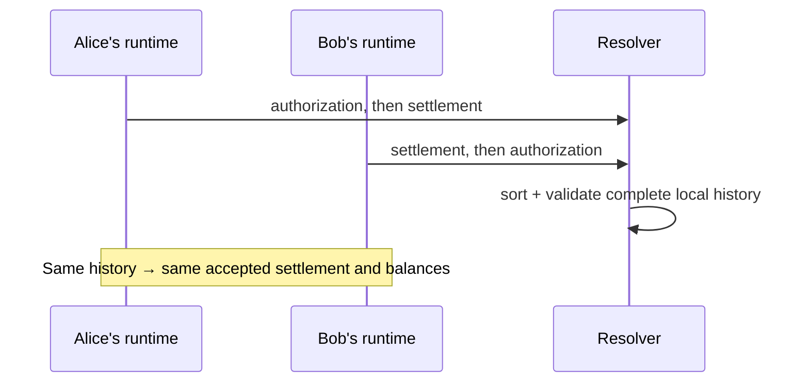

# Lesson 26: Why Order-Independent Results Matter

Peers do not receive records in one shared, perfect order. Alice may receive a proposal before its key authorization; Bob may receive the authorization first. Both must reach the same answer once they have the same complete history.

## What you already know

An HTTP server often applies writes in one database transaction order:

```text
POST /authorizations  → row exists
POST /transfers       → server validates the row
```

Replication is different. Arrival is transport timing, not the meaning of the records.



## One small example

```ts
const receivedInDifferentOrders = [
  [authorization, acceptedProposal, transfer],
  [transfer, authorization, acceptedProposal],
];

for (const records of receivedInDifferentOrders) {
  const result = resolveTimebankMemberFeeds(records);
  console.log(result.balances);
}
```

**Expected observation:** the resolver does not settle the transfer until the supporting records are present, but both complete inputs produce the same balances. A duplicate identical record changes nothing; two different records with one ID are rejected as a conflict.

## Peer Hours connection

`@peer-hours/timebank-records` normalizes envelopes, deduplicates identical records, sorts them deterministically, and then passes recognized records to identity, proposal, and ledger rules. A desktop screen should show what the resolver knows locally—not assume that the last network message is true.

## Takeaway

Arrival order is an unreliable network detail. A deterministic resolver turns a shared set of immutable facts into a shared result.

## Next lesson

Continue with [Lesson 27: What is a member-key authorization?](27-member-key-authorization.md).
