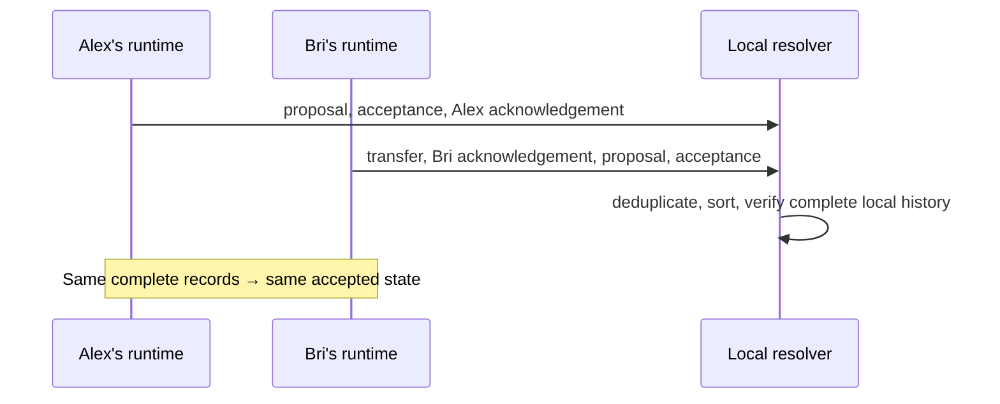

# Lesson 26: Why Order-Independent Results Matter

Peers do not receive records in a shared perfect order. A device can receive a settlement transfer before a pending proposal, or Bri’s acknowledgement before Alex’s. Arrival timing is a network fact, not protocol meaning.



## A progressive example

```ts
const early = resolveTimebankMemberFeeds([proposal, acceptance, transfer]);
// transfer is not admitted: acknowledgements are absent.

const complete = resolveTimebankMemberFeeds([
  transfer, briAcknowledgement, proposal, acceptance, alexAcknowledgement,
]);
// same result on every peer that has this same complete set.
```

**Expected observation:** before both valid acknowledgements and attestations are present, no normal settlement is admitted. After the complete set is present, the deterministic transfer ID and stable resolver ordering give each peer the same candidate result.

## What “same result” does—and does not—mean

The resolver deduplicates exact replays and rejects conflicting records that claim the same identity. It verifies signatures, checks that acceptance preserves pending terms, and evaluates ledger policy in deterministic transfer-ID order. This prevents “first message wins” behavior.

It does **not** mean every peer has the same records now, that a record is durable everywhere, or that a quorum has agreed. Different local histories can legitimately produce different temporary local views.

## Takeaway

Replication order is transport noise. Deterministic resolution makes a complete shared history useful without pretending the network has a single clock.

## Next lesson

Continue with [Lesson 27: What is a member-key authorization?](27-member-key-authorization.md).
