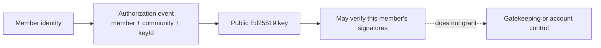

# Lesson 27: What Is a Member-Key Authorization?

A member-key authorization says that one public signing key may act for one member in one community. It is not approval to participate, and it is not a password.



## What you already know

An OAuth access token often grants a list of server-controlled permissions. Peer Hours uses a narrower idea: a signed record is checked against a public key that the member has made active for a particular community.

```json
{
  "action": "activate",
  "memberId": "member-alex",
  "communityId": "peer-hours/earth/US/CA/east-bay/oakland",
  "keyId": "laptop-2026",
  "publicKey": "base64url-ed25519-public-key",
  "occurredAt": "2026-07-18T12:00:00.000Z"
}
```

## One small example

```ts
const active = reduceMemberKeyAuthorizations([activateLaptop, revokeOldPhone]);
const key = active.get("member-alex", "laptop-2026");
verifyRecordSignature(record, key);
```

**Expected observation:** a signature made with an active key for Alex in Oakland can verify. The same key cannot silently authorize a record for a different member or community. A later revocation makes it inactive.

## Peer Hours connection

`@peer-hours/timebank-identity` reduces activation and revocation events deterministically. Its verifier is used by record resolution to check authorship and transfer attestations. This provides self-managed cryptographic identity; it does not introduce a membership administrator.

## Takeaway

The authorization answers “which public key can prove this member signed here?” It does not answer “may this person join?”

## Next lesson

Continue with [Lesson 28: What is an accepted proposal?](28-accepted-proposal.md).
