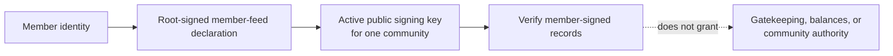

# Lesson 27: What Is a Member-Key Authorization?

A member-key authorization binds a public signing key to one member in one community. It lets a verifier answer a narrow question: “may this public key verify a signature for this member here?” It is not an account, a password, or permission to join.



## One small example

```ts
const active = reduceMemberKeyAuthorizations([activateLaptop, revokeOldPhone]);
const key = active.get("member-alex", "laptop-2026");
verifyMemberSignedRecord(record, [key]);
```

**Expected observation:** a signature made by Alex’s active Oakland key can verify an Alex-authored Oakland proposal. The same key cannot silently authorize a record for Bri or for another community. A revocation removes the key from the active set used for new verification.

## Why scope is important

The same human may use different devices, rotate keys, or participate in several communities. Community scope prevents a key declaration intended for one record history from becoming a blanket authorization everywhere. The resolver also checks the record-specific role after signature verification: a valid key cannot make Alex author Bri’s acceptance.

## Peer Hours connection

The implemented resolver combines legacy key events with self-owned, root-signed feed declarations, then verifies member-originated domain records against that public authorization material. This supports self-managed identity; it does not establish a membership authority or a central recovery service.

## Takeaway

Authorization answers “which public key may prove this member signed this community-scoped record?” It does not answer “may this person participate?”

## Next lesson

Continue with [Lesson 28: What is a pending and accepted proposal?](28-accepted-proposal.md).
