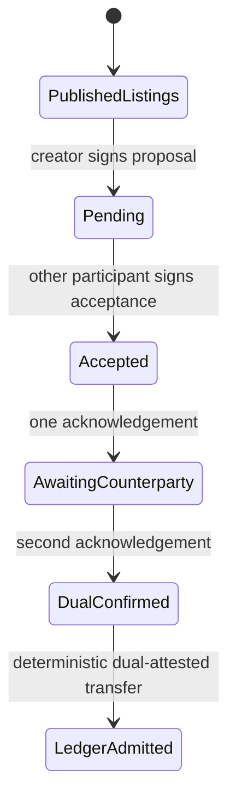

# Lesson 28: What Is a Pending and Accepted Proposal?

A proposal is an immutable exchange offer between two participants. It has two related records—not one mutable row:



## The pending proposal is evidence, not a draft row

Alex may publish a proposal for Alex to provide Bri 60 minutes of gardening. Its immutable terms include both listing IDs, both participant IDs, community, minutes, and `creatorMemberId`. A pending-proposal record is valid only when its creator signs it; it contains no acceptance data.

```json
{
  "id": "proposal-garden-help",
  "providerMemberId": "alex",
  "receiverMemberId": "bri",
  "creatorMemberId": "alex",
  "minutes": 60,
  "status": "proposed"
}
```

Bri accepts by publishing a separately signed accepted-proposal record. Bri must be the participant other than the creator, and the acceptance must preserve every pending term exactly.

```ts
const accepted = acceptExchangeProposal({
  proposal,
  offer,
  request,
  provider: alex,
  recipient: bri,
  acceptedByMemberId: "bri",
});
```

**Expected observation:** changing the minutes, participants, listings, creator, or community in the acceptance causes local resolution to reject it when the pending proposal is available.

## What acceptance does not do

Acceptance shows mutual intent to exchange time. It does not post a balance, prove work occurred, or make a settlement final. Completion still requires participant acknowledgements, a deterministic transfer with both cryptographic attestations, and local ledger admission.

## Takeaway

Pending and accepted proposals make consent inspectable: one participant proposes immutable terms; the other separately accepts those exact terms.

## Next lesson

Continue with [Lesson 29: What is a settlement transfer?](29-transfer.md).
