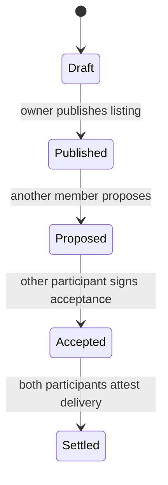

# Lesson 28: What Is an Accepted Proposal?

An accepted proposal is the durable agreement between two people about a possible exchange. It comes before settlement: agreeing to exchange time is different from confirming that the time was delivered.



## What you already know

In a server application, an order might move from `pending` to `confirmed` in one mutable row. Peer Hours preserves the acceptance as an immutable, signed fact instead.

```json
{
  "proposalId": "proposal-42",
  "providerMemberId": "alex",
  "recipientMemberId": "bri",
  "minutes": 60,
  "communityId": "peer-hours/earth/US/CA/east-bay/oakland"
}
```

## One small example

```ts
const accepted = acceptProposal(proposal, {
  authorMemberId: "bri",
  occurredAt: "2026-07-18T12:15:00.000Z",
});
```

**Expected observation:** only the participant other than the proposal creator can accept it. The accepted terms retain the exact community, participants, and minute amount that a later settlement must match.

## Peer Hours connection

`@peer-hours/timebank-domain` models draft listings, published listings, proposals, and acceptance rules. `@peer-hours/timebank-records` requires the accepting member to author the signed accepted-proposal envelope. This is a tested resolver rule; the desktop acceptance screen is still future work.

## Takeaway

Acceptance captures mutual intent. It is evidence for a later settlement, not a balance change by itself.

## Next lesson

Continue with [Lesson 29: What is a transfer?](29-transfer.md).
